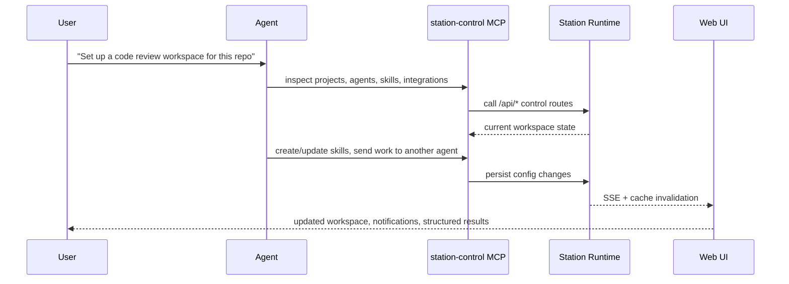
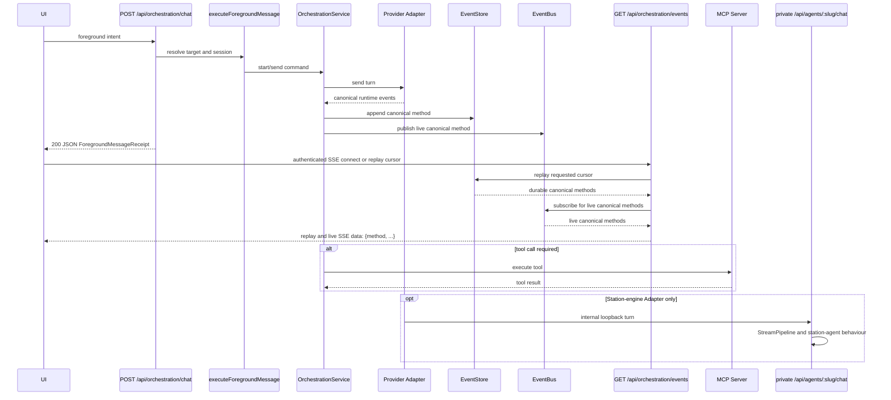
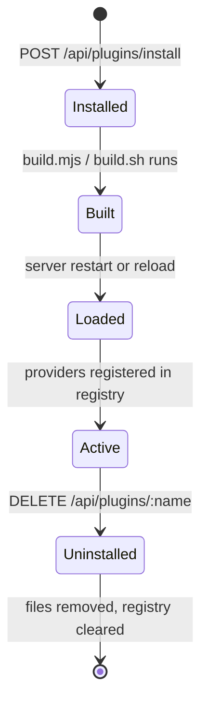
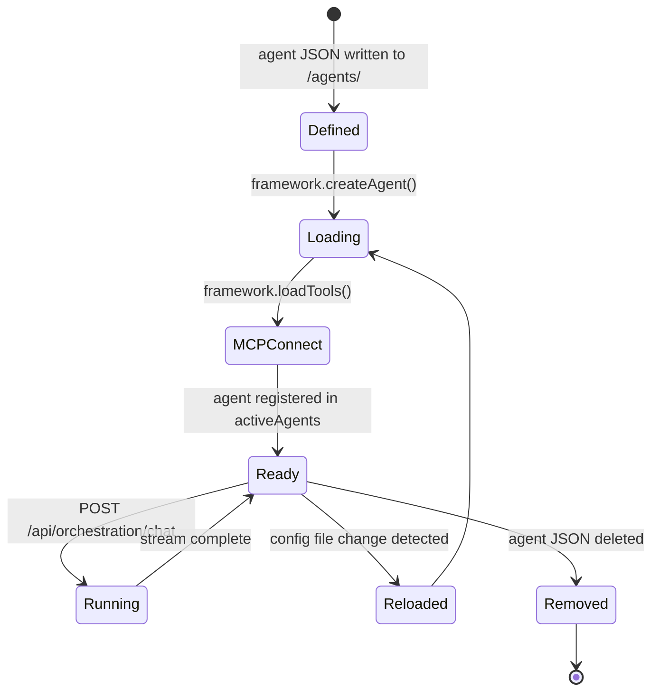
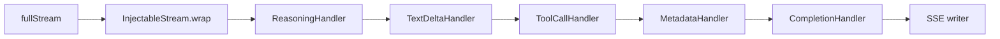

# Station Architecture

> **Contributor route:** [Module map](architecture/module-map.md) is the current
> map for deep Modules: their caller Interfaces, composition Seams, concrete
> Adapters, invariants, and real tests. Use it before restructuring a caller
> family. New behaviour belongs behind an intent-shaped Interface, not a raw
> store or a post-construction setter.

## System Overview

Station is a local-first agent workspace built around pluggable Providers and
engines. It runs as a self-hosted server alongside extensions and built-in
product Modules.

**Core and extension composition:**
- The core server (`src-server/`) provides the HTTP Interface, execution and
  streaming pipelines, MCP lifecycle, Provider registry, and Station's durable
  product Modules.
- Extensions are installed into `<STATION_HOME>/plugins/` and register providers (auth, branding, agent registry, integration registry, settings, user identity, and related behaviour) that the core discovers at startup. Extensions can also ship agents, tools, and UI.
- The SDK (`packages/sdk/`) is the published contract between the core and extension UIs — extensions import from `@kontourai/station-sdk` and never call the server directly.

This means Station core can be upgraded independently of extensions, and
extensions can be swapped without changing an engine.

---

## Architecture Diagram

```mermaid
graph TB
    subgraph Clients
        UI[Web UI / Tauri Desktop]
        CLI[station CLI / external CLI]
    end

    subgraph Core Server [channel-resolved server port]
        RT[StationRuntime]
        RT --> |mounts| ROUTES[Hono Routes]
        RT --> |manages| AGENTS[Active Agents]
        RT --> |manages| MCP[MCPManager]
        RT --> |emits| EB[EventBus]
        RT --> |emits| ME[MonitoringEmitter]
        ME --> |SSE fan-out| EB
        ME --> |disk| MEVT[events-DATE.ndjson]

        ROUTES --> |POST /api/orchestration/chat| FOREGROUND[executeForegroundMessage]
        FOREGROUND --> ORCH[OrchestrationService]
        ORCH --> ADAPTER[Provider Adapter]
        ADAPTER --> EVENTS[Canonical event projection]
        EVENTS --> |append durable method| STORE[EventStore]
        EVENTS --> |publish live method| EB
        ROUTES --> |GET /api/orchestration/events| EVENT_STREAM[Authenticated SSE replay + subscription]
        STORE --> |replay cursor| EVENT_STREAM
        EB --> |live subscription| EVENT_STREAM
        ADAPTER --> |Station engine only| PRIVATE_CHAT[Private POST /api/agents/:slug/chat]
        PRIVATE_CHAT --> STREAM[StreamPipeline]

        ROUTES --> |/knowledge/*| KS[KnowledgeService]
        KS --> SQV[(sqlite-vec)]
    end

    subgraph Voice [:port+2]
        VSS[VoiceSessionService]
        S2S[S2S Provider / Nova Sonic]
        WS[WebSocket]
        VSS --> S2S
        VSS --> WS
    end

    subgraph Plugins [<STATION_HOME>/plugins/]
        P1[Plugin A]
        P2[Plugin B]
        P1 & P2 --> |register| PROV[Provider Registry]
        PROV --> |auth / branding / registry / settings| RT
    end

    subgraph MCP Servers
        MCP1[stdio process]
        MCP2[HTTP/WS server]
    end

    subgraph Monitoring Stack
        OTEL[OTel Collector :4318]
        PROM[Prometheus :9090]
        GRAF[Grafana :3333]
        JAE[Jaeger :16686]
    end

    subgraph Packages
        SDK[@kontourai/station-sdk]
        CONN[@kontourai/station-connect]
        SHARED[@kontourai/station-shared]
    end

    UI --> |HTTP JSON + authenticated SSE| ROUTES
    UI --> SDK
    UI --> |WebSocket| WS
    ROUTES --> |/voice/*| VSS

    AGENTS --> |tool calls| MCP
    MCP --> MCP1 & MCP2

    RT --> |OTLP| OTEL
    OTEL --> PROM & JAE
    PROM --> GRAF
```

### Station-engine chat topology

Every interactive caller enters the orchestration execution Seam at `POST
/api/orchestration/chat`. It returns one JSON `ForegroundMessageReceipt` with
the conversation/session and resolved target; it does not carry the event
stream. `GET /api/orchestration/events` is the independent authenticated SSE
Interface for replay and live canonical methods. For a Station-engine agent,
the private `station-agent` Adapter relays over internal loopback to `POST
/api/agents/:slug/chat`; that private route owns the StreamPipeline,
feedback/behaviour injection, RAG, title generation, per-turn chat dedup, and
the FileMemory transcript. It is not the interactive caller Seam and must not
be used to bypass orchestration. See [ADR 0014](adr/0014-the-chat-convergence-landed-unconditionally-not-behind-the-flag.md).

---

## Module Map

| Module | Location | Description |
|---|---|---|
| `StationRuntime` | `src-server/runtime/bootstrap/station-runtime.ts` | Top-level orchestrator — initializes agents, mounts routes, starts ACP, runs health checks |
| `StreamOrchestrator` | `src-server/runtime/conversation/stream-orchestrator.ts` | Standalone functions — `createStreamingPipeline()`, `createElicitationCallback()`, SSE write helpers |
| `StreamPipeline` | `src-server/runtime/streaming/StreamPipeline.ts` | Chains `StreamHandler` instances as async generators; supports abort |
| `MCPManager` | `src-server/runtime/mcp/mcp-manager.ts` | Owns negotiated MCP connections, preserves raw metadata/results, and adapts tools at the engine boundary |
| `AcpAdapter` / `ACPProcess` | `src-server/providers/adapters/acp-adapter.ts` / `src-server/services/acp/acp-process.ts` | Provider Adapter and per-thread process Implementation; it maps ACP output to canonical orchestration events |
| `ConversationManager` | `src-server/runtime/conversation/conversation-manager.ts` | Context management and stats for conversations |
| `ToolExecutor` | `src-server/runtime/tools/tool-executor.ts` | Wraps tools with elicitation-based approval gates |
| `ApprovalRegistry` | `src-server/services/approvals/approval-registry.ts` | Holds pending tool-approval promises; resolved by the `/tool-approval/:id` endpoint |
| `AgentService` | `src-server/services/agents/agent-service.ts` | CRUD operations for agent config files |
| `MCPService` | `src-server/services/plugins/mcp-service.ts` | Service-layer wrapper around MCPManager for route handlers |
| `LayoutService` | `src-server/services/projects/layout-service.ts` | Workspace and workflow file management |
| `SchedulerService` | `src-server/services/scheduling/scheduler-service.ts` | Cron-based agent invocation scheduling |
| `EventBus` | `src-server/services/orchestration/event-bus.ts` | In-process pub/sub for SSE fan-out to connected clients |
| `MonitoringEmitter` | `src-server/monitoring/emitter.ts` | Emits structured GenAI-aligned events (chat turns, tool calls, completions) to EventBus and disk |
| `KnowledgeService` | `src-server/services/knowledge/knowledge-service.ts` | sqlite-vec-backed vector store (ADR-0009) for document indexing, chunking, and semantic search; supports namespaces |
| `VoiceSessionService` | `src-server/voice/` | Manages voice sessions; connects to S2S providers (Nova Sonic); handles tool execution during voice; WebSocket on port+2 |
| `ConfigLoader` | `src-server/domain/config-loader.ts` | Reads/writes agent YAML, app config, ACP config; watches for file changes |
| `FileMemoryAdapter` | `src-server/adapters/file/memory-adapter.ts` | Persists conversations and messages to `.station/` on disk |
| `UsageAggregator` | `src-server/analytics/usage-aggregator.ts` | Aggregates token usage from persisted events |
| `BedrockModelCatalog` | `src-server/providers/llm/bedrock-models.ts` | Resolves and validates Bedrock model IDs |
| `InjectableStream` | `src-server/runtime/streaming/InjectableStream.ts` | Wraps `fullStream` to allow out-of-band event injection (e.g. approval requests) |
| Framework Adapter | `src-server/runtime/frameworks/voltagent-adapter.ts` or `strands-adapter.ts` | Pluggable adapter layer between the runtime and the underlying AI SDK |
| Provider Registry | `src-server/providers/registries/registry.ts` | Singleton registry for all plugin-provided implementations |

For the high-leverage runtime Modules and their actual caller/test surfaces, see
the [Module map](architecture/module-map.md): session query/command,
turn/adoption/recovery ledgers, credential recovery, connection inspection,
task dispatch/graph, pairing completion, and instance reconciliation.

---

## Self-Configuring Loop

`station-control` makes Station self-managing rather than just chat-driven. A
Station agent can use the same platform APIs the UI uses to reshape the
workspace while it works.



Key pieces in the loop:

- `src-server/tools/station-control-*.ts` exposes management tools over MCP.
- `src-server/runtime/mcp/mcp-manager.ts` injects delegation metadata for child-agent sends and internal provenance for agent-authored skill changes.
- `src-server/runtime/agents/delegation.ts` enforces isolated child sessions with depth limits, blocked tools, and approval denial for delegated children.
- `src-server/services/approvals/approval-inbox.ts` and `src-server/services/approvals/approval-guardian.ts` turn approval-bound tool calls into inbox items and optional guardian-reviewed decisions.
- `src-server/services/agents/skill-usage-service.ts` tracks run/outcome quality per skill so agents can refine their own skills over time.

This is the architectural difference between “chatting with an agent” and “letting agents shape the system they run inside.”

---

## Data Flow: Chat Request



`AcpAdapter` follows this same sequence. Its `ACPProcess` is private to the
Adapter Implementation: there is no ACP-specific chat route, event vocabulary,
or alternate SSE path. See [the ACP guide](guides/acp.md) for connection
configuration and process diagnostics.

---

## Plugin Lifecycle



**Install** — The plugin directory is copied into `<STATION_HOME>/plugins/<name>/`. If a `build.mjs` or `build.sh` exists, it runs to produce `dist/`.

**Load** — On startup (or after a reload), `loadPluginProviders()` scans `plugins/`, reads each `plugin.json` manifest, and dynamically imports provider modules. Each provider is registered in the appropriate singleton slot (auth, branding, agentRegistry, etc.).

**Render** — Plugin UI bundles are served from `/api/plugins/:name/dist/:file`. The web UI loads them as IIFE bundles via `<script>` injection. Plugins use `@kontourai/station-sdk` hooks and components — they never call the server directly.

**Uninstall** — The plugin directory is deleted. On next reload, the registry is cleared and rebuilt without the removed plugin. Agents and tools installed by the plugin are also removed.

---

## Agent Lifecycle



**Define** — An agent is a JSON file in `<STATION_HOME>/agents/<slug>/agent.json` (schema: `schemas/agent.schema.json`). It specifies model, prompt, tools, guardrails, and MCP server references.

**Load** — `framework.createAgent()` reads the spec, resolves the model via the configured provider, creates a `FileMemoryAdapter`, and delegates to the active framework adapter (VoltAgent or Strands).

**Chat** — `agent.streamText()` is called with the user input and conversation context. The result's `fullStream` is piped through the `StreamPipeline` and written as SSE.

**Monitor** — `agent-start` and `agent-complete` events are emitted to `monitoringEvents` and persisted to `<STATION_HOME>/monitoring/events-<date>.ndjson`. OTel spans and metrics are recorded for each request.

---

## ACP (Agent Communication Protocol)

`AcpAdapter` is the Provider Adapter for an external engine reached over ACP. It owns one
`ACPProcess` per active thread: process spawn/initialization, ACP session and
prompt/cancel calls, and bounded teardown stay inside that Implementation. The
managed orchestration Seam receives the resulting provider facts and projects
them into the same canonical orchestration events used by every other provider;
raw ACP notifications do not become a caller Interface.

ACP configuration and capability probing remain concrete engine-process work. The
adapter uses the probe result to form a launchable provider shape, while the
orchestration Module retains session ownership, receipts, recovery, and event
projection. For configuration, operational constraints, and supported
capabilities, see [the ACP guide](guides/acp.md).

---

## Voice Subsystem

The voice subsystem (`src-server/voice/`) provides a real-time speech-to-speech interface. `VoiceSessionService` manages session lifecycle, connects to S2S providers (default: Nova Sonic), and handles tool execution during active voice turns. REST routes at `/voice/sessions`, `/voice/status`, and `/voice/agent` manage session control; the audio stream runs over a WebSocket on `port + 2`.

Voice providers are pluggable — plugins can register `STTProvider`, `TTSProvider`, or `ConversationalVoiceProvider` via `voiceRegistry` in the SDK.

---

## Knowledge Service

`KnowledgeService` (`src-server/services/knowledge/knowledge-service.ts`) is a sqlite-vec-backed vector store (ADR-0009 replaced the original LanceDB-named store, which was never actually the LanceDB library). It handles document ingestion (chunking + embedding), namespace-scoped indexing, and semantic search. Routes are mounted at `/knowledge/*`. Namespaces allow agents and plugins to maintain isolated knowledge domains within the same store.

---

## Monitoring Emitter

`MonitoringEmitter` (`src-server/monitoring/emitter.ts`) is the application-level event system, separate from OTel. It emits structured events aligned to the GenAI semantic conventions — chat turns, tool calls, and completions. Each event is:

1. Published to `EventBus` for real-time SSE delivery to connected clients
2. Persisted to `<STATION_HOME>/monitoring/events-<date>.ndjson` for offline analysis

This is distinct from the OTel pipeline: OTel handles infrastructure-level spans and metrics; `MonitoringEmitter` handles product-level event tracking. `UsageAggregator` reads the persisted NDJSON files to compute token usage summaries.

---

## Streaming Pipeline

The `StreamPipeline` is a chain of `StreamHandler` instances, each implemented as an async generator. Handlers process the output of the previous handler — zero or more output chunks per input chunk.



| Handler | Responsibility |
|---|---|
| `ReasoningHandler` | Buffers `<thinking>` blocks; emits `reasoning` events; holds all chunks during thinking so injected approval events appear at the right boundary |
| `TextDeltaHandler` | Pass-through for text events (reasoning handler already formats them correctly) |
| `ToolCallHandler` | Augments `tool-call` events with parsed `server` and `tool` fields for UI display |
| `MetadataHandler` | Emits usage stats and monitoring events on stream completion |
| `CompletionHandler` | Tracks accumulated text, finish reason, and whether any output was produced |

The `InjectableStream` wrapper allows the elicitation callback to inject `tool-approval-request` events into the stream at chunk boundaries without modifying the underlying `fullStream`.

Abort is handled via `AbortController` — the pipeline checks the signal before each yielded chunk, and the client disconnect listener calls `abort()`.

---

## Extension Points

| Extension Point | How to Hook In |
|---|---|
| **Auth provider** | Plugin registers `AuthProvider` — controls login, session validation, and user identity |
| **User identity** | Plugin registers `UserIdentityProvider` — supplies user alias, name, and profile |
| **User directory** | Plugin registers `UserDirectoryProvider` — user lookup and search |
| **Agent registry** | Plugin registers `AgentRegistryProvider` — supplies the browsable agent catalog |
| **Integration registry** | Plugin registers `IntegrationRegistryProvider` — supplies the browsable MCP integration catalog |
| **Skill registry** | Plugin registers `SkillRegistryProvider` — supplies the browsable skill catalog |
| **Plugin registry** | Plugin registers `PluginRegistryProvider` — supplies the plugin marketplace/catalog |
| **Branding** | Plugin registers `BrandingProvider` — overrides logo, colors, app name |
| **Settings** | Plugin registers `SettingsProvider` — adds plugin-specific settings UI |
| **Notification provider** | Plugin registers `NotificationProvider` — contributes notifications via `poll()` |
| **MCP tools** | Any stdio/HTTP/WebSocket MCP server can be referenced in an agent's `tools.mcpServers` |
| **ACP connections** | Any CLI that implements the Agent Client Protocol can be connected via `/acp/connections` |
| **Voice providers** | Plugins register `STTProvider`, `TTSProvider`, or `ConversationalVoiceProvider` via `voiceRegistry` (SDK) |
| **Context providers** | Plugins register `MessageContextProvider` via `contextRegistry` (SDK) to inject context into chat messages |
| **Layout providers** | Plugins register layout-level data providers via `registerProvider` (SDK) |
| **Scheduler** | Agents can be invoked on a cron schedule via `POST /scheduler/jobs` |

---

## Packages

### `src-server/` — Core Server
The runtime, HTTP API, streaming pipeline, MCP lifecycle, ACP bridge, analytics, telemetry, and all provider interfaces. Runs on Node.js, built with esbuild to `dist-server/command-station.js`. Its REST + SSE port is resolved by the shared channel runtime context; it is not a packaged-client start path.

Provider ownership inside `src-server/` is now split intentionally:
- `src-server/providers/provider-interfaces.ts` owns server-only provider interfaces such as `IBrandingProvider`, `IAuthProvider`, and template/registry abstractions. `ISchedulerProvider` is an internal core composition interface, not a plugin registration SDK; scheduler extensions use the authenticated HTTP/SDK projection that exists today.
- `src-server/providers/provider-contracts.ts` re-exports provider-adjacent contract types that are owned by `@kontourai/station-contracts/*`.
- `src-server/providers/llm/model-provider-types.ts` owns server-local LLM, embedding, and vector provider runtime interfaces.
- The old `src-server/providers/types.ts` compatibility barrel was removed. Internal server code should import the focused module directly.

#### Service layout

`src-server/services/` is grouped by feature area rather than kept flat — it had
grown to 106 modules in a single directory, where finding the right file meant
scanning an alphabetical list. Each group owns its own `__tests__/`, so a
subject and its tests sit together.

| Directory | Owns | Bounded context |
|---|---|---|
| `acp/` | Agent Client Protocol bridge, manager, probe, subprocess | Agent Runtime |
| `agents/` | Agent and skill CRUD, skill usage/metadata services, policy | Agent Runtime |
| `approvals/` | Tool-approval registry, inbox, guardian | Agent Runtime |
| `connections/` | Model/agent-app connections, provider service, launchability | Agent Runtime |
| `orchestration/` | Session lifecycle, run projection, event bus and store | Agent Runtime |
| `evidence/` | Trust bundles, readiness, platform-mutation gate, console bridge | Evidence Governance |
| `flow/` | Flow runs and the evidence bridges into them | Evidence Governance |
| `plugins/` | Plugin manifests and permissions, MCP service, templates | Extension Ecosystem |
| `projects/` | Projects, layouts, Workspace Panes, file tree, proposed changes, task graph | Workspace Surfaces |
| `work-item-providers/` | Work-item provider implementations | Workspace Surfaces |
| `knowledge/` | Namespaces, documents, search, storage | Operations |
| `scheduling/` | Built-in scheduler and cron | Operations |
| `notifications/` | Notification service and web push | Operations |
| `feedback/` | Message feedback capture and analysis | Operations |
| `ssh/` | OpenSSH environments, device pairing, environment security | Operations |
| `terminal/` | Terminal sessions, shells, subprocess state | Operations |
| `infra/` | Cross-cutting primitives: json store, SSE broadcaster, process utils | — |

The contexts referenced above are defined in `docs/contexts/*/CONTEXT.md`. A
handful of cross-cutting integration tests remain in
`src-server/services/__tests__/` because they exercise several groups at once.

#### Route layout

`src-server/routes/` is grouped the same way, for the same reason — it was 83
modules in one directory. Route groups mirror the service groups where the
concepts line up, so `routes/knowledge/` calls into `services/knowledge/`:

| Directory | Owns |
|---|---|
| `chat/` | Chat endpoints, streaming, persistence, model override, conversations |
| `agents/` | Agent CRUD, tools, skills, templates, invoke paths |
| `orchestration/` | Runs, tasks, work items, events, operating state, attention |
| `connections/` | Model and agent-app connections, providers, Bedrock, ACP |
| `knowledge/` | Knowledge documents, index, records, store, graph |
| `plugins/` | Plugin lifecycle, install, bundles, host approval, public surface, registry |
| `evidence/` | Flow runs, trust bundles, readiness, sidecars, proposed changes, diffs |
| `projects/` | Projects, layouts, coding surface, filesystem, UI commands |
| `system/` | System status/update, config, activation, diagnostics, auth, branding |
| `operations/` | Scheduler, notifications, push, voice, feedback, analytics, monitoring, SSH |
| `schemas/` | Request/response schema definitions and validation helpers |

#### Runtime and provider layout

`src-server/runtime/` (54 modules) and `src-server/providers/` (33) were grouped
the same way. A small number of files stay at each root because they are the
directory's shared vocabulary rather than members of any one group —
`runtime/types.ts`, and the provider seams (`provider-interfaces.ts`,
`provider-contracts.ts`, `adapter-shape.ts`, `resolver.ts`,
`connection-factories.ts`, `plugin-provider-loader.ts`, `lancedb-provider.ts`).

| Directory | Owns |
|---|---|
| `runtime/bootstrap/` | Runtime construction, startup/shutdown, HTTP, ports, process lifecycle, health |
| `runtime/agents/` | Agent build, lifecycle, registry, context and template variables, hooks, delegation |
| `runtime/frameworks/` | VoltAgent and Strands adapters, model factory, adapter registry and readiness |
| `runtime/tools/` | Tool approval and execution, control/generation tools, vended-tool compat |
| `runtime/conversation/` | Conversation manager and stats, event log, stream orchestration, usage |
| `runtime/mcp/` | MCP manager, UI resolver, UI frame server |
| `runtime/plugins/` | Plugin assets and loading, provider resolution, configuration lease |
| `runtime/streaming/` | The streaming pipeline and its handlers |
| `providers/llm/` | Model providers (Bedrock, Anthropic, Google, Ollama, OpenAI-compatible) and catalogs |
| `providers/registries/` | Integration, plugin, and skill registries |
| `providers/sessions/` | External session sources and attachment handling |
| `providers/auth/` | Provider credential paths |
| `providers/adapters/` | Per-provider adapters (ACP, Bedrock, Claude, Codex, Ollama) |

#### Attached external session follow

Station can follow a bounded external-agent transcript without taking over its
execution. An attached session carries `controlMode: 'read-only-attached'` and
stable, non-path source metadata in the orchestration read model; records that
predate the field remain `station-owned` for compatibility. The Claude source
reads only regular, non-symlink JSONL files beneath
`$CLAUDE_CONFIG_DIR/projects` (or the normal Claude config root), maps supported
records to `CanonicalRuntimeEvent`, and imports only unseen event IDs on the
bounded follow cadence. A disappeared source preserves the last transcript but
never claims the external process is still live.

The command and lifecycle boundaries enforce ownership before provider adapter
lookup. `read-only-attached` sessions therefore reject send, approval,
interrupt, stop, resume/retry, and other orchestration mutations even if a
client bypasses the UI. Session Board exposes only Open with a read-only label;
the Sessions detail projects the canonical event stream through
`projectRuntimeEventsToMessages()` and shared message content rendering, with
no compose, approval, delegation, rating, or form controls.

### `packages/sdk/` — `@kontourai/station-sdk`
The plugin UI contract. Exports React hooks (`useAgents`, `useConversations`, `useSendMessage`, `useToolApproval`, etc.), query factories, API client functions (`streamMessage`, `invoke`, `callTool`), UI primitives (`Button`, `Spinner`, `Pill`), voice/context registries, and layout provider utilities. Plugins import from here — never from the server directly.

### `packages/connect/` — `@kontourai/station-connect`
Multi-host connection management for mobile and remote scenarios. Exports
`ConnectionStore`, `ConnectionsProvider`, `useConnectionStatus`, `useHostUrl`,
`useConnectionCandidates`, `QRDisplay`, `QRScanner`, and
`ConnectionManagerModal`. Handles same-origin access requests, fallback
QR/manual pairing, non-trusting provider suggestions, and connection persistence
via a pluggable `StorageAdapter`. Plain browsers do not scan guessed LAN
subnets; native LAN DNS-SD, tailnet, and desktop-host adapters register through
the candidate-provider boundary.

### `packages/contracts/` — `@kontourai/station-contracts`
Canonical cross-package API, runtime, and orchestration contracts. Owns stable domain shapes for agents, auth, catalog, config, knowledge, layouts, notifications, plugins, projects, provider kinds, runtime sessions/events, scheduler entities, and tools.

### `packages/shared/` — `@kontourai/station-shared`
Compatibility re-exports plus explicit helper subpaths. The package root is now for shared type compatibility, while helper utilities such as `buildPlugin()`, `copyPluginIntegrations()`, `readPluginManifest()`, and `resolveGitInfo()` live on `@kontourai/station-shared/build`, `@kontourai/station-shared/parsers`, and `@kontourai/station-shared/git`.

### `packages/cli/` — `@kontourai/station-cli`
The `station` CLI binary. Wraps the server startup and provides developer commands.

### `src-ui/` — Web UI
React + Vite frontend. Consumes `@kontourai/station-sdk`. Built to `dist-ui/` and served by the server in production. In development, runs on port 5173 with `VITE_API_BASE` pointing at the server.

### `src-desktop/` — Desktop App
Tauri wrapper around the web UI for native desktop distribution.

---

## Related Docs

- `docs/guides/agents.md` — creating and configuring agents
- `docs/guides/plugins.md` — building and installing plugins
- `docs/reference/api.md` — full HTTP API reference
- `docs/reference/config.md` — app and agent config schemas
- `docs/reference/contracts.md` — `@kontourai/station-contracts` ownership and module map
- `docs/reference/connect.md` — `@kontourai/station-connect` API
- `docs/reference/shared.md` — `@kontourai/station-shared` API
- `docs/guides/monitoring.md` — OTel, Prometheus, Grafana setup
