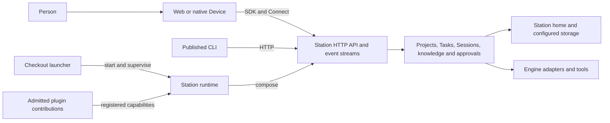
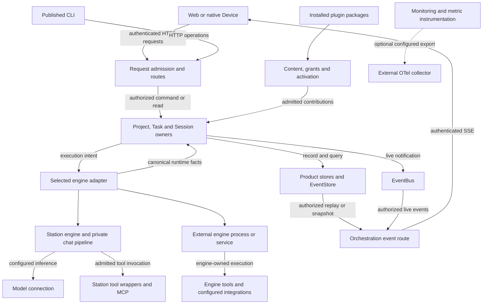
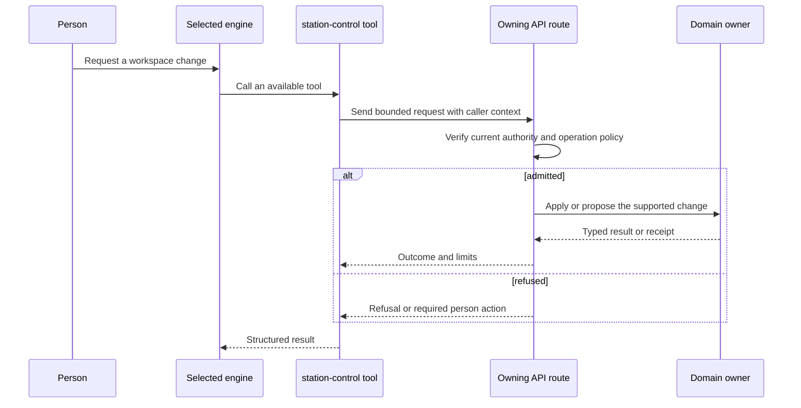
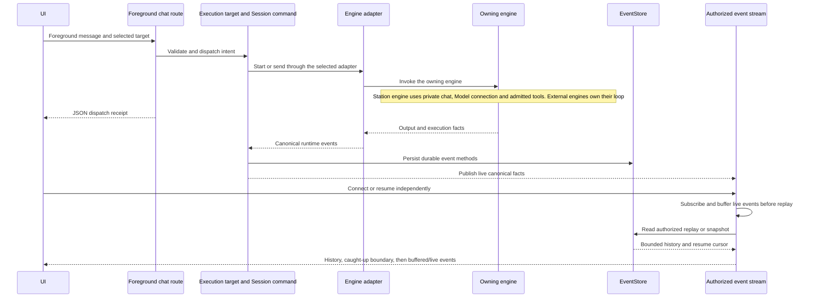
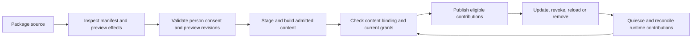
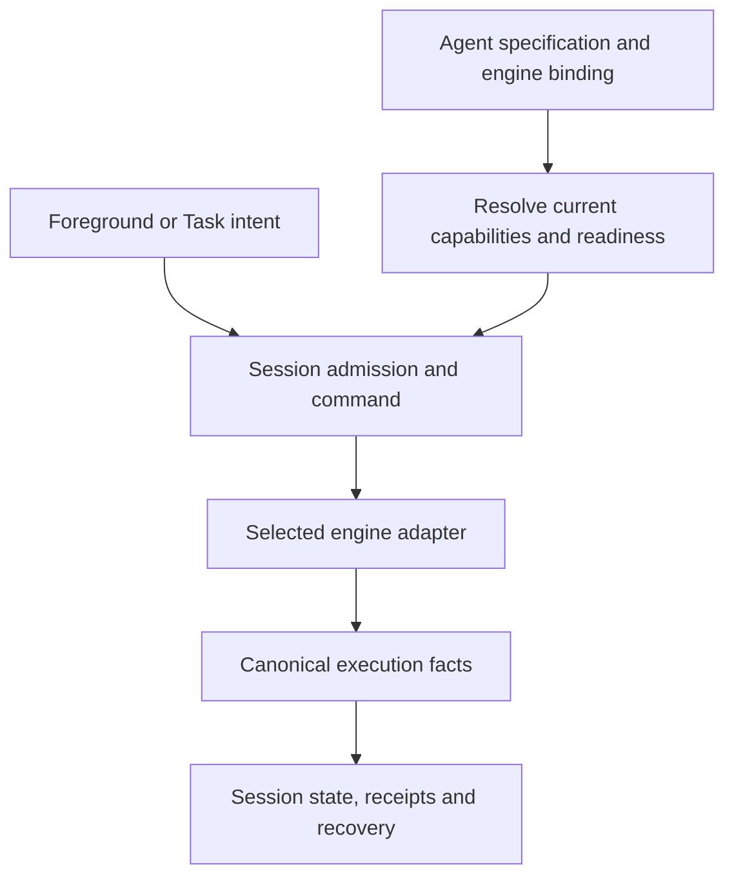
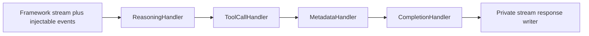

# Station Architecture

Station's server owns work records and coordinates the selected engines.
Web and native Devices let people inspect that work, arrange their workspace
and submit requests; adapters connect execution to models, tools and hosts.
This page explains those responsibilities and where their authority differs.

> **Contributor route:** [Module map](architecture/module-map.md) is the current
> map for deep Modules: their caller Interfaces, composition Seams, concrete
> Adapters, invariants, and real tests. Use it before restructuring a caller
> family. New behaviour belongs behind an intent-shaped Interface, not a raw
> store or a post-construction setter.

## Reading path

Read this page for the system shape, then follow one journey through its
contract, caller, implementation, and tests. The [module map](architecture/module-map.md)
is the detailed interface catalog; it is not a prerequisite for understanding
the product. [Concepts](user/concepts.md) and the [glossary](glossary.md) explain
the user-facing vocabulary first.

```mermaid
flowchart LR
    Person[Person] --> Device[Web or native Device]
    Device -->|SDK and Connect| API[Station HTTP API and event streams]
    CLI[Published CLI] -->|HTTP| API
    Launcher[Checkout launcher] -->|start and supervise| Runtime[Station runtime]
    Runtime -->|compose| API
    API --> Domain[Projects, Tasks, Sessions, knowledge and approvals]
    Domain --> Storage[Station home and configured storage]
    Domain --> Engines[Engine adapters and tools]
    Plugins[Admitted plugin contributions] -->|registered capabilities| Runtime
```

This is a logical overview, not a complete network or authorization diagram.
Device, account, Project, and tool authorization are distinct boundaries;
follow their owning guides when changing a request path.

| Question | Explanation | Code entry point |
| --- | --- | --- |
| How does a Station start? | [Development](guides/development.md) and [deployment](guides/deployment.md) | [Server entry](../src-server/index.ts), [runtime composition](../src-server/runtime/bootstrap/station-runtime.ts) |
| How do clients find and access it? | [Connections](guides/connections.md), [Connect reference](reference/connect.md), [deployment authentication](guides/deployment-authentication.md) | [Connect package](../packages/connect/README.md), [HTTP composition](../src-server/runtime/bootstrap/runtime-http.ts) |
| How does a chat become execution and visible events? | [Chat request sequence](#data-flow-chat-request), [Session API](reference/session-api.md) | [Foreground execution](../src-server/services/execution-target/execution-target-execution.ts), [orchestration service](../src-server/services/orchestration/orchestration-service.ts) |
| Who owns Projects, Tasks, and their state? | [Concepts](user/concepts.md), [module interfaces](architecture/module-map.md) | [Project contracts](../packages/contracts/src/project.ts), [Project services](../src-server/services/projects/) |
| How do plugins extend the application? | [Plugin guide](guides/plugins.md), [runnable examples](../examples/README.md) | [Plugin contract](../packages/contracts/src/plugin.ts), [provider admission](../src-server/providers/plugin-provider-loader.ts) |
| Who owns a streamed browser or device view? | [Browser workspace](guides/browser-workspace.md), [Device workspace](guides/mobile-device-workspace.md), [shared live surface](architecture/module-map.md#shared-live-surface) | [Browser composition](../src-server/services/browser/browser-service.ts), [live-surface registry](../src-server/services/live-surface/registry.ts) |
| Which CLI operations run locally? | [CLI availability](reference/cli.md), [package README](../packages/cli/README.md) | [Distribution boundary](../packages/cli/src/distribution.ts), [command dispatch](../packages/cli/src/cli.ts) |
| Where do I find behavior evidence? | [Testing](guides/testing.md), each module's evidence section | [Verification lane definitions](../scripts/verification-lanes.mjs) |

Source links locate the implementation; they do not certify every claim on this
page. A source review, an executed integration test, and a verified deployment
are different evidence. See the [audit plan](plans/documentation-code-audit.md)
for the scope still awaiting review.

## System Overview

Station connects people, durable work and agent execution. A Project owns work
and access; a Task retains an intent and its references; a Session records an
execution episode. A configured Agent selects an engine, but its existence
alone does not mean that an engine is running or that a provider is available.

The server owns admission, product state and execution coordination. Web and
native Devices present that state and submit requests through authenticated
transports. The SDK supplies public extension interfaces; built-in UI also has
Station-owned state and navigation modules. Installed plugins contribute only
through their admitted contracts and current grants. Installation, consent,
runtime activation and successful execution are separate facts.

Station home contains configuration and local product records; Project
workspaces and configured knowledge/provider storage have their own owners.
Local-first does not mean every operation stays on the machine: selected Model
connections, external engines, tools, voice and optional exporters may use
remote services. Their configuration and authority determine those effects.

## Architecture Diagram

```mermaid
flowchart TB
    Device[Web or native Device] -->|authenticated HTTP requests| Routes[Request admission and routes]
    CLI[Published CLI] -->|HTTP operations| Routes
    Routes -->|authorized command or read| Domain[Project, Task and Session owners]
    Domain -->|record and query| Store[Product stores and EventStore]
    Domain -->|execution intent| Adapter[Selected engine adapter]
    Adapter --> StationEngine[Station engine and private chat pipeline]
    Adapter --> ExternalEngine[External engine process or service]
    StationEngine -->|configured inference| Model[Model connection]
    StationEngine -->|admitted tool invocation| Tools[Station tool wrappers and MCP]
    ExternalEngine -->|engine-owned execution| ExternalTools[Engine tools and configured integrations]
    Adapter -->|canonical runtime facts| Domain
    Domain -->|live notification| Bus[EventBus]
    Store -->|authorized replay or snapshot| Stream[Orchestration event route]
    Bus -->|authorized live events| Stream
    Stream -->|authenticated SSE| Device
    Plugins[Installed plugin packages] --> Admission[Content, grants and activation]
    Admission -->|admitted contributions| Domain
    Observation[Monitoring and metric instrumentation] -.->|optional configured export| Collector[External OTel collector]
```

This is a responsibility diagram, not a universal call sequence. Tool execution
stays with its engine and approved tool path; OrchestrationService coordinates
execution and records facts rather than directly executing every tool.
[Engine adapters](../src-server/providers/adapters/),
[Station Agent construction](../src-server/runtime/agents/runtime-agent-builder.ts),
[MCP adaptation](../src-server/runtime/mcp/mcp-manager.ts), and
[event delivery](../src-server/routes/orchestration/orchestration.ts) own those
edges. Built-in tools and external engines have different authorization and
approval paths; MCP availability does not grant every tool operation.

Monitoring is separate from canonical execution state. The dotted export edge
exists only when configured, and [monitoring](guides/monitoring.md) documents
its evidence limits, including the startup meter-binding issue
[#2755](https://github.com/kontourai/station/issues/2755). An instrument
registration or exporter startup log is not collector receipt.

Terminal and voice use dedicated WebSocket listeners and are not represented
by the HTTP/SSE arrow. Browser/Device frames use a binary HTTP stream. A
same-origin UI/API proxy does not by itself expose the dedicated socket ports;
transport-specific configuration and platform qualification remain necessary.

### Station-engine chat topology

The supported foreground chat entry point is `POST /api/orchestration/chat`.
It returns a JSON `ForegroundMessageReceipt`; accepted dispatch is distinct
from the later turn outcome. `GET /api/orchestration/events` independently
carries authorized replay/snapshot and live canonical events.

For Station-engine turns, the `station-agent` adapter relays internally to
`POST /api/agents/:slug/chat`. That private path owns framework streaming,
elicitation, transcript-related work and Station-engine behavior. It is not a
second public chat entry point. External engines retain their own execution
loops behind adapters. See [ADR 0014](adr/0014-the-chat-convergence-landed-unconditionally-not-behind-the-flag.md)
and the [Session API](reference/session-api.md).

## Module Map

These are navigation entry points, not an exhaustive inventory:

| Responsibility | Owner | Detailed contract |
| --- | --- | --- |
| Startup and composition | `src-server/runtime/bootstrap/station-runtime.ts`, `runtime-initialize.ts` | [Development](guides/development.md) |
| Session commands, reads and recovery | `src-server/services/orchestration/` | [Module map](architecture/module-map.md#sessioncommandmodule) |
| Engine adaptation | `src-server/providers/adapters/` | [Agent guide](guides/agents.md) |
| Station-engine stream composition | `src-server/runtime/conversation/stream-orchestrator.ts` | [Streaming pipeline](#streaming-pipeline) |
| MCP connection and tool adaptation | `src-server/runtime/mcp/mcp-manager.ts` | [Plugin and tool contracts](guides/plugins.md) |
| Agent configuration | `src-server/services/agents/agent-service.ts`, `src-server/domain/config-loader.ts` | [Agent guide](guides/agents.md) |
| Scheduling | `src-server/services/scheduling/scheduler-service.ts` | [Scheduler ledger](architecture/module-map.md#schedulerledger-and-builtinscheduler) |
| Browser sessions and streamed input | `src-server/services/browser/browser-service.ts`, `src-server/services/live-surface/registry.ts` | [Browser workspace](guides/browser-workspace.md) |
| Knowledge source and derived indexes | `src-server/knowledge-store/`, `src-server/knowledge-index/` | [Knowledge guide](guides/knowledge.md) |
| Monitoring observations | `src-server/monitoring/emitter.ts` | [Monitoring](guides/monitoring.md) |
| Voice sessions and provider exchange | `src-server/voice/voice-session.ts` | [Voice subsystem](#voice-subsystem) |

ConfigLoader reads and writes JSON configuration and watches supported Agent and
integration changes; it is not the storage owner for all product state.
SchedulerService supports the configured cron, interval and one-shot contracts,
not just cron. MonitoringEmitter publishes to its own monitoring EventEmitter
and persistence callback, not the orchestration EventBus. Follow each owner
before treating a similarly named helper as the current implementation.

## Self-Configuring Loop

An admitted Agent can inspect and request supported Station changes through
`station-control`. The caller's engine, credential custody, delegation limits
and the target operation decide what it may do. Person-only installation,
approval or operator actions do not become Agent authority merely because a
tool can name them.

```mermaid
sequenceDiagram
    participant Person
    participant Engine as Selected engine
    participant Tool as station-control tool
    participant Route as Owning API route
    participant Owner as Domain owner
    Person->>Engine: Request a workspace change
    Engine->>Tool: Call an available tool
    Tool->>Route: Send bounded request with caller context
    Route->>Route: Verify current authority and operation policy
    alt admitted
        Route->>Owner: Apply or propose the supported change
        Owner-->>Route: Typed result or receipt
        Route-->>Tool: Outcome and limits
    else refused
        Route-->>Tool: Refusal or required person action
    end
    Tool-->>Engine: Structured result
```

The [tool definitions](../src-server/tools/station-control-mcp-server.ts),
[delegation owner](../src-server/runtime/agents/delegation.ts),
[approval inbox](../src-server/services/approvals/approval-inbox.ts), and domain
routes provide the implementation. UI refresh depends on that feature's event,
invalidation or polling path. A successful tool response does not prove that
all Devices refreshed or that an external effect was reversed after failure.

## Data Flow: Chat Request

```mermaid
sequenceDiagram
    participant UI
    participant Route as Foreground chat route
    participant Execution as Execution target and Session command
    participant Adapter as Engine adapter
    participant Engine as Owning engine
    participant Store as EventStore
    participant Events as Authorized event stream
    UI->>Route: Foreground message and selected target
    Route->>Execution: Validate and dispatch intent
    Execution->>Adapter: Start or send through the selected adapter
    Adapter->>Engine: Invoke the owning engine
    Note over Engine: Station engine uses private chat, Model connection and admitted tools. External engines own their loop
    Route-->>UI: JSON dispatch receipt
    Engine-->>Adapter: Output and execution facts
    Adapter-->>Execution: Canonical runtime events
    Execution->>Store: Persist durable event methods
    Execution-->>Events: Publish live canonical facts
    UI->>Events: Connect or resume independently
    Events->>Events: Subscribe and buffer live events before replay
    Events->>Store: Read authorized replay or snapshot
    Store-->>Events: Bounded history and resume cursor
    Events-->>UI: History, caught-up boundary, then buffered/live events
```

The sequence separates responsibilities; a Device may already have its event
stream open when it sends, and output can arrive while dispatch settles.
[executeForegroundMessage](../src-server/services/execution-target/execution-target-execution.ts)
resolves the target, [OrchestrationService](../src-server/services/orchestration/orchestration-service.ts)
coordinates commands and canonical events, and the
[event route](../src-server/routes/orchestration/orchestration.ts) subscribes
before replay so new events cannot overtake the catch-up boundary. Reads and
live delivery apply current audience authority; a replay cursor is not access.

Only durable methods are EventStore history. In-process events, monitoring
records and a request acknowledgment are not interchangeable completion
receipts. Retrying a command whose provider effect is uncertain is different
from resuming an event stream. ACP follows this public orchestration contract;
its process protocol is private to its adapter.

## Plugin Lifecycle

```mermaid
flowchart LR
    Source[Package source] --> Preview[Inspect manifest and preview effects]
    Preview --> Consent[Validate person consent and preview revisions]
    Consent --> Stage[Stage and build admitted content]
    Stage --> Grants[Check content binding and current grants]
    Grants --> Active[Publish eligible contributions]
    Active --> Change[Update, revoke, reload or remove]
    Change --> Reconcile[Quiesce and reconcile runtime contributions]
    Reconcile --> Grants
```

This is a responsibility flow, not a promise that every install becomes active.
[Install transactions](../src-server/services/plugins/plugin-install-transaction.ts)
branch on package format and reconcile captured consent before publication.
[Provider admission](../src-server/providers/plugin-provider-loader.ts) and
[grant reconciliation](architecture/module-map.md#plugingrantreconciliation)
keep durable approval separate from current runtime activation. Changed or
unreadable reviewed bytes can withhold permissions; reconciliation may be
incomplete. The [plugin guide](guides/plugins.md) owns the complete workflow.

UI contributions use the public SDK and [Pane contracts](guides/workspace-pane-authoring.md).
A portable Agent Plugins package is not interchangeable with a legacy Station
layout/plugin package. Follow [Agent Plugins](reference/agent-plugins.md) for
format-specific loading and installation boundaries.

## Agent Lifecycle

```mermaid
flowchart TD
    Definition[Agent specification and engine binding] --> Availability[Resolve current capabilities and readiness]
    Intent[Foreground or Task intent] --> Command[Session admission and command]
    Availability --> Command
    Command --> Adapter[Selected engine adapter]
    Adapter --> Events[Canonical execution facts]
    Events --> Lifecycle[Session state, receipts and recovery]
```

An authored Agent record, engine availability and a running Session have
different lifetimes. Agent JSON lives under
`<STATION_HOME>/agents/<id>/agent.json`; the selected connection and engine
capability matrix determine which fields can actually be delivered. The
[configuration owner](../src-server/domain/config-loader-agents.ts),
[engine classification](../src-server/runtime/agents/agent-engine-classification.ts)
and [runtime builder](../src-server/runtime/agents/runtime-agent-builder.ts)
keep those facts separate.

[Session commands](architecture/module-map.md#sessioncommandmodule),
[turn boundaries](architecture/module-map.md#sessionturnboundaryauthority), and
[lifecycle transitions](architecture/module-map.md#sessionlifecyclemodule) own
execution and recovery. A persisted definition, saved setting or observed
engine process is not proof of a successful turn. Monitoring describes
execution; it does not replace its durable outcome.

## ACP (Agent Client Protocol)

`AcpAdapter` owns an `ACPProcess` for an active thread and translates supported
engine protocol facts into canonical orchestration events. Spawn, handshake,
prompt/cancel and teardown stay inside that implementation; clients do not
consume raw ACP notifications as Station's public event contract.

Compatibility depends on the selected executable, negotiated capabilities and
Station's adapter support. “Speaks ACP” is not a universal guarantee of model
selection, authentication, slash-command autocomplete or tool delivery. Follow
[the ACP guide](guides/acp.md) and its real probe/test owners for those limits.

## Voice Subsystem

The server's [VoiceSessionService](../src-server/voice/voice-session.ts) owns
voice-session lifetime and an injected S2S provider. Current bootstrap supplies
Nova Sonic through [the server composition](../src-server/runtime/bootstrap/runtime-service-bootstrap.ts).
Voice REST control and audio transport are separate: startup attaches the
voice WebSocket listener at the API server's port plus two, with its own
credential/scope and browser-origin checks.

The [UI adapter](../src-ui/src/providers/voice/NovaVoiceSessionAdapter.ts)
queries the advertised voice port and [derives its URL](../src-ui/src/hooks/voiceWsUrl.ts)
using `ws:` or `wss:` from the selected endpoint. It does not add two to
the browser-visible UI port. The CLI's same-origin HTTP/SSE proxy and a single
container port mapping do not establish reachability or TLS termination for
that socket. Terminal has a similar dedicated-listener boundary. No networking
change or live voice qualification is implied by this diagram review.

The SDK's [voiceRegistry](../packages/sdk/src/voice/registry.ts) registers
Device-side STT/TTS implementations; its other public voice session/realtime
interfaces have separate consumers. Registering one is not registration of a
server `IS2SProvider`. Follow the [SDK reference](reference/sdk.md) and
[voice module](architecture/module-map.md#voiceturnruns-and-correlated-s2s-v1)
for the exact supported composition and receipt boundaries.

## Knowledge Service

Knowledge has two coexisting paths. The legacy `KnowledgeService` owns
namespace/document operations through configured storage, embedding and vector
providers. Registered Knowledge roots, record adapters and successor indexes
have separate source/index owners; a provider's presence does not merge those
stores or establish complete retrieval.

Start with [the Knowledge guide](guides/knowledge.md), then
[KnowledgeStoreProvider](architecture/module-map.md#knowledgestoreprovider),
[SqliteVecIndexProvider](architecture/module-map.md#sqlitevecindexprovider), and
[file transactions](architecture/module-map.md#knowledgefiletransactions).
Source records, derived indexes, graph extraction and reviewed learning are
different responsibilities. Their provider, freshness and authority limits
remain visible rather than being collapsed into one RAG box.

## Monitoring Emitter

[MonitoringEmitter](../src-server/monitoring/emitter.ts) redacts an observation,
emits it on the monitoring EventEmitter, and calls its injected persistence
function. Pending writes are tracked for flush; persistence rejection is caught.
The [runtime event log](../src-server/runtime/conversation/runtime-event-log.ts)
owns daily NDJSON files. This is separate from orchestration EventStore replay
and its execution receipts.

`UsageAggregator` reads retained observations; missing data and provider usage
semantics remain explicit in [usage telemetry](reference/usage-telemetry.md).
Optional OTel export and the collector/dashboard stack are described in
[monitoring](guides/monitoring.md). Neither a dashboard nor an empty metric is
an authoritative account of whether product work happened.

## Streaming Pipeline

Station-engine private chat composes async-generator handlers in this order:

```mermaid
flowchart LR
    Input[Framework stream plus injectable events] --> Reasoning[ReasoningHandler]
    Reasoning --> Tools[ToolCallHandler]
    Tools --> Metadata[MetadataHandler]
    Metadata --> Completion[CompletionHandler]
    Completion --> Writer[Private stream response writer]
```

[createStreamingPipeline](../src-server/runtime/conversation/stream-orchestrator.ts)
chooses the handlers; [StreamPipeline](../src-server/runtime/streaming/StreamPipeline.ts)
executes them. Reasoning buffering, tool metadata, usage observations and
completion accumulation are private streaming responsibilities, not a second
public orchestration protocol. Elicitation can inject events through
[InjectableStream](../src-server/runtime/streaming/InjectableStream.ts).

The pipeline checks its abort signal during consumption. That does not promise
instant cancellation of every provider/tool effect already in flight.
[Pipeline integration tests](../src-server/runtime/streaming/__tests__/pipeline.integration.test.ts)
exercise handler composition; real provider cancellation needs separate proof.

## Extension Points

| Extension boundary | Current owner and limitation |
| --- | --- |
| Server plugin providers | [Provider loading](../src-server/providers/plugin-provider-loader.ts) admits configured factory contributions; consumed types and lifecycle are documented in [Plugins](guides/plugins.md). A generic registry key is not proof that a product consumer reads it. |
| Agent definitions, skills and MCP integrations | Installed format and authority determine materialization and availability; see [Agent Plugins](reference/agent-plugins.md). |
| Tool servers | [ToolDef](../packages/contracts/src/tool.ts) and [MCP connection factory](../packages/shared/src/mcp-connection.ts) support stdio, SSE and Streamable HTTP. Negotiation, auth and engine delivery still need qualification. |
| External engines | [Adapter contract](../src-server/providers/adapter-shape.ts), configured connections and capability probes; protocol compatibility alone is insufficient. |
| Extension UI | Public SDK and Workspace Pane declarations; host context and current contribution grants remain required. |
| Device-side voice/context | Public SDK registries and session interfaces; separate from server provider factories. |
| Scheduling | Authenticated Scheduler HTTP/SDK/CLI operations; `ISchedulerProvider` is internal composition, not a public plugin registration API. |

Server-only provider interfaces under `src-server/providers/` are not SDK types
plugins should import. Model/embedding/vector consumers resolve configured
capability connections through ProviderService; arbitrary generic registration
does not automatically replace them. Keep plugin consent, current grants and
runtime activation distinct from the existence of an interface.

## Packages

### `src-server/` — Core Server

Node server code owns bootstrap, API admission, domain coordination and runtime
adapters. The build produces `dist-server/command-station.js`; launchers/native
hosts still own startup configuration and process lifetime. Source imports and
an available build artifact do not themselves establish a running instance.

#### Service layout

Services are grouped by domain. Use the [repository layout](guides/repository-layout.md)
and [module map](architecture/module-map.md) rather than a copied directory count.
A service interface should own behavior and invariants; its directory is not
proof of an enforced bounded context.

#### Route layout

Routes are grouped by feature and composed in `runtime/routes/`. Public route
mounts, middleware and object-level authorization belong in the same review.
A route factory by itself does not prove its production mount or deployment
availability. See [backend patterns](patterns/backend.md).

#### Runtime and provider layout

Bootstrap chooses implementations; Agent, conversation, MCP, plugin and stream
submodules keep their distinct lifetimes. Canonical contracts belong in
`packages/contracts`; provider-specific execution stays behind server adapters.
Use the [repository layout](guides/repository-layout.md) for source locations and
package READMEs for supported entry points.

#### Attached external session follow

Station discovers supported Claude Code and Codex transcripts, Grok Build
sessions and OpenCode's session database through its Session sources. A
`read-only-attached` record imports observed history without taking over the
external process. Missing files or stale observations do not prove that
the external engine is live or controllable.

Command ownership checks refuse mutations of the original attached execution.
Adoption is a deliberate exception that can create an independently authorized
child Session; it does not confer control over the original process. Follow
[Session inventory Sources](architecture/module-map.md#session-inventory-sources)
and [adoption](architecture/module-map.md#adoptionledger) for the exact import,
lineage and authority rules.

### `packages/sdk/` — `@kontourai/station-sdk`

The public SDK exposes supported request helpers, query/mutation hooks, host
context hooks and extension UI contracts. Examples include `useAgentsQuery`,
`useAgentQuery` and `agentQueries`; they require their owning host/transport
setup. Its [README](../packages/sdk/README.md), [reference](reference/sdk.md)
and package exports own the current surface. Host-context hooks and remote-query
hooks have different return shapes and prerequisites; follow their declarations
and current host integration.

The headless [Agent entry](../packages/sdk/src/agent/index.ts) re-exports the
canonical Agent authoring and execution clients. It excludes UI dependencies;
plug-in UI stays on the root and owning UI subpaths. Both share contract and
transport owners. See [Agent development](guides/agent-development.md) and
[ADR 0021](adr/0021-separate-plugin-and-agent-sdk-surfaces.md).

### `packages/connect/` — `@kontourai/station-connect`

Connect owns saved Station connections, pairing, discovery and selected
transport lifecycle. It is private in this checkout; that says nothing about
historical package publication. Use its owning Station integration and
[README](../packages/connect/README.md), not an assumption that it is a currently
published plugin dependency. Reachability candidates, pairing credentials,
account identity and Project membership remain separate facts.

### `packages/contracts/` — `@kontourai/station-contracts`

Canonical cross-package types and parsers live here. The package ships TypeScript
source and explicit subpath exports. A data shape carries only the authority
its owning runtime validates; copying a contract object cannot mint a grant.
See [the package README](../packages/contracts/README.md).

### `packages/shared/` — `@kontourai/station-shared`

Shared helpers and compatibility re-exports serve Station packages. Use explicit
helper subpaths such as `/parsers`, `/build` and `/git`; not every Node helper is
browser-safe. Contracts remain owned by the contracts package. The
[README](../packages/shared/README.md) documents supported imports.

### `packages/cli/` — `@kontourai/station-cli`

The published CLI calls running Stations and exposes selected installed-system
operations. The checkout's `./station` launcher additionally owns source build,
setup and supervision. [distribution.ts](../packages/cli/src/distribution.ts)
and the [CLI README](../packages/cli/README.md) define the boundary. A command
existing in source does not mean the published CLI can execute it locally.

### `src-ui/` — Web UI

React/Vite UI consumes SDK/Connect plus Station-owned navigation, cache and
Device settings. The UI may be served with an API proxy or packaged in a native
shell; that choice does not merge every HTTP, SSE and dedicated WebSocket
transport. [Frontend patterns](patterns/frontend.md), [theming](guides/theming.md)
and [responsive contracts](guides/responsive-ui.md) locate the shared owners.

### `src-desktop/` — Desktop App

Tauri hosts the web UI and native desktop/mobile integrations, including native
credential, transport and startup boundaries. Native capabilities and platform
availability require their own evidence; a web fixture does not qualify a
packaged shell. See [native-shell verification](guides/native-shell-verification.md).

## Related Docs

- [Module map](architecture/module-map.md) — deeper interfaces, invariants and tests.
- [Repository layout](guides/repository-layout.md) — directory and package ownership.
- [Agents](guides/agents.md), [Plugins](guides/plugins.md), and [Session API](reference/session-api.md) — authoring and execution contracts.
- [Connections](guides/connections.md) and [deployment authentication](guides/deployment-authentication.md) — reachability and authority.
- [Knowledge](guides/knowledge.md), [Browser](guides/browser-workspace.md), and [Device workspace](guides/mobile-device-workspace.md) — subsystem journeys.
- [Flow integration](../src-server/services/flow/flow-run-service.ts) — optional Project workflow/evidence integration through public Kontour package contracts, not a prerequisite for ordinary chat.
- [Monitoring](guides/monitoring.md) and [testing](guides/testing.md) — observation and evidence limits.
