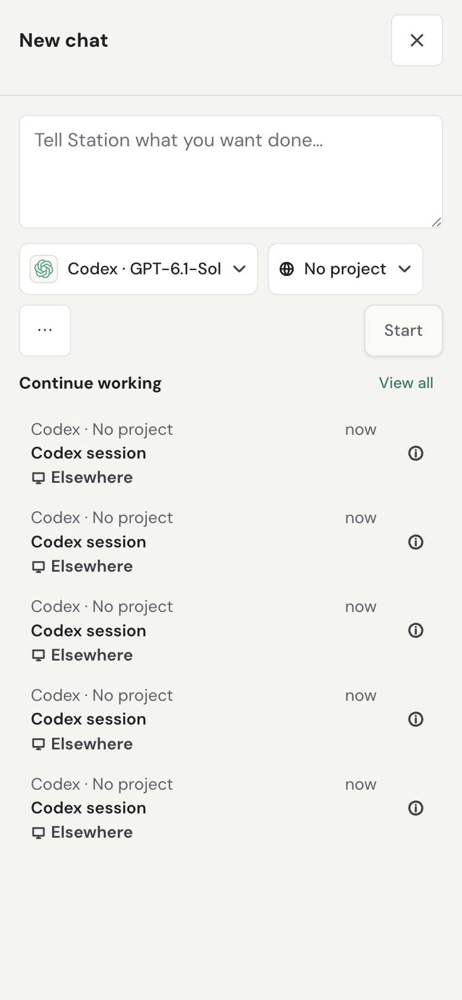
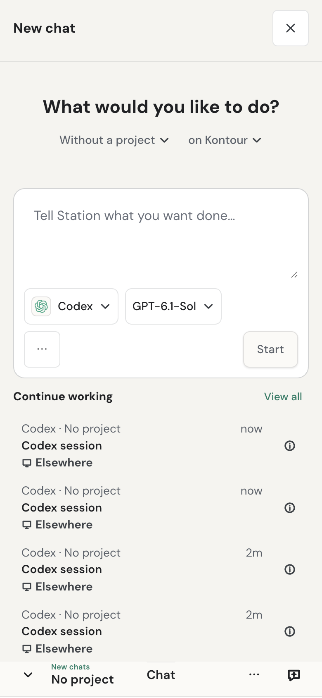
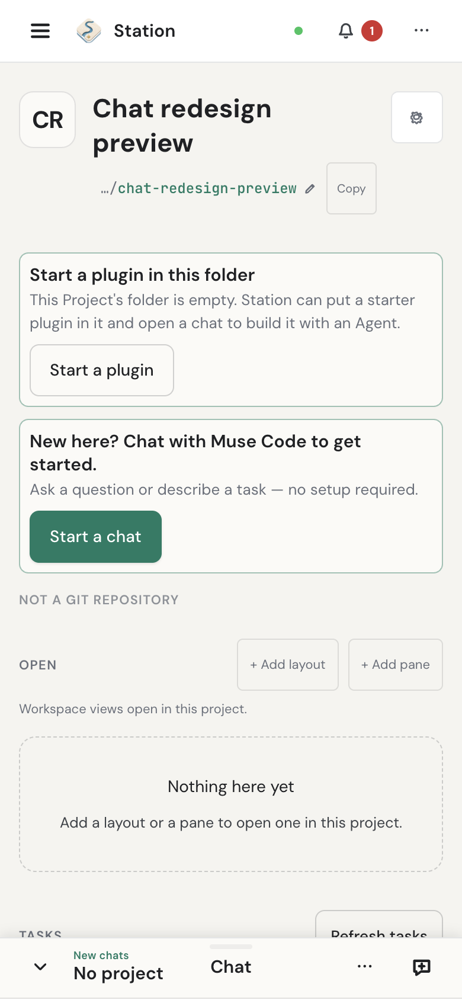
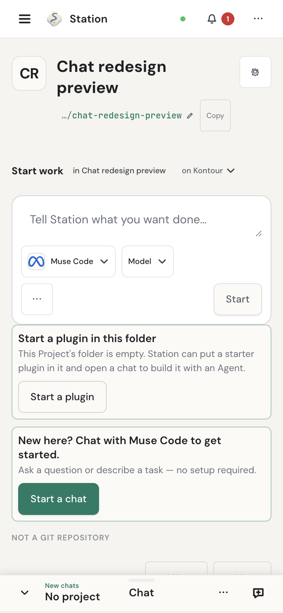

# Design: Chat composer & the agent-navigability principle

> **Reading status: interaction policy with dated design evidence.** Section 2
> records the 2026-07-26 audit; the sequencing and shipped-status statements
> belong to their recorded work. Section 4 below describes the current public
> HTTP entry points. Current control rendering and sending are owned by
> [ChatDockBody](../../src-ui/src/components/chat-dock/ChatDockBody.tsx) and
> [foreground dispatch](../../src-ui/src/lib/foregroundMessageDispatch.ts).
> The mobile product decisions remain binding; this document is not a fresh
> browser, accessibility, or native-device test result.

> Status: **composer hierarchy, the provider/model picker, prerequisite
> guidance, shortcuts, and final Settings polish shipped through #1354.**
> This is the contract for the chat composer/dock and for the principle it
> enforces. Revise this doc — not just the code — when direction changes.

## Interaction stability and conversation continuity

Every conversation uses the chat dock's reading surface and header, including
conversations discovered in another coding app. A quiet "Started in Claude Code"
(or the observed app name) identifies origin. Discovery is not evidence of running
work; history uses source-event time and remains separate from active work.

Opening a conversation or typing does not migrate it. The composer accepts a
normal draft. Send (or the configured Return shortcut, except during IME composition) opens a one-time
"Continue here?" confirmation; Cancel preserves the draft and Shift+Return adds a
line. Confirmation opens the continuation through the normal dock controller
and hands the exact draft to the normal sender once. The original conversation
remains available in its original app. A failed opening retains the reader and offers a
retry that does not create another continuation. Metadata is available through
an explicit Details action.

Message action rows reserve their layout space. Hover and keyboard focus may
reveal controls, but must not change bubble size or the position of later messages.
During an authorized active-turn continuation wait, the composer accepts and
preserves a draft. Sending and queueing stay blocked until continuation is writable.
The shared popover shell opens toward the roomier viewport edge, including when
the dock is maximized. A narrow Activity region shows its list or its selected
detail, with a Back to list control, instead of squeezing both columns.

## Starting and resuming work

The phone-width captures compare the baseline and redesigned controls in the
same isolated sample home and light theme. They show appearance, not task
execution or native-shell qualification. Capture revisions and limits are in
[the media manifest](../learn/media.json).

| Surface | Before | After |
| --- | --- | --- |
| New chat |  |  |
| Project page |  |  |

New chat opens the shared start composer. Home renders it inline, and an
operator's Project page renders a compact version above its activity with
the Project fixed. Project and Station controls sit above the text box;
separate Agent and Model controls sit inside it beside Start and the overflow
for visual skills. The Agent list retains each Agent's readiness and repair
action, with a short purpose for custom Agents. The Model picker offers search, recent choices, favorites and provider
filters; Options reveals capability filters and the selected model's supported
runtime controls. Reviewed canonical model identities still own grouping across
provider routes; similar names do not establish equivalence.

The **on <host>** control names the answering Station's host projection, or
**on Project default** when the Project has a saved execution environment. It
opens the existing task launcher with the current message, Project and Agent,
and with its Station/worker/model routing controls expanded. The launcher
loads the selected environment's own worker inventory and retains portable
Project/resource admission and the explicit no-fallback refusals. **Run task**
starts a task; it does not place or migrate a foreground chat on a peer. Editing
the task message updates the originating draft, so Cancel retains those edits.
A successful launch clears only the text submitted and names its captured
Station; newly typed text stays. Remote task submission and Escape do not
submit or dismiss the underlying foreground composer. Prepared visual skills
and coding-context drafts keep their existing chat-only path.

A Project page start hands the dock its fixed Project without changing the
ambient dock binding. An unavailable fixed Project blocks starting and keeps
the message. Returned drafts are scoped to that Project and Station authority.
A project with no folder can still be chosen and runs where the server puts it:
the home folder, or for an ACP engine its connection folder or a private
Station-managed workspace. The project menu states the run-location hint.
Up to five recent chats from the
selected project or No project follow; with none, the composer stands alone.
A start or hand-off from Home is taken only by the ambient dock, which says
so (the intent is cancelable); Home keeps its message until the chat starts,
then removes only the text it sent. A dismissed dock draft (from a hand-off
or a Start) comes back as edited there: into an empty field directly,
otherwise behind Restore your earlier draft (a swap) and Discard it, with a
polite announcement. Waiting drafts are kept in the tab's session storage, so
they survive a reload but not closing the tab.
The inbox, mobile switcher, and start surface share their row anatomy. Touch
cards allow two title lines while status and metadata keep predictable positions.
When Continue holds Home's only item of work, Recent work is not shown and
View Activity sits beside the Continue heading.
Home's Recent work rows are the same row: a decorative mark before the Project
name is the Project's chosen icon, or, without one, a dot in its sidebar colour
(the name stays plain text); a row read from another Station draws no mark,
since its slug names that Station's Project. The hover card's Project row
repeats that mark, and its Git section reads the row's local session folder, as
in the dock.
The shared New chat action remains directly reachable in mobile chrome and at
the lower right of the inbox; footer space keeps it from covering rows.

Choosing on a chip does not start an engine; a choice is remembered (Agent per
context, Model per binding, project as the dock's binding). Start hands the
message to the dock’s existing sender once; Home's Start hands the dock its
exact chip selection, which the dock starts through the same path. Setup actions retain the draft
through the authority-fenced return journey. A removed preference requires an
explicit replacement; an unavailable preference keeps its reason and repair.
Home’s composer shows the same remembered Agent, repair included; only with no Agent to offer does its Start run the quick-start preparation. The mobile overflow holds
chat actions rather than repeating the app header’s connection-health row.
When fullscreen chat hides that header, its actions sheet retains Station
management and connection state.

## Chat controls and attention

Live approval, connection, and working status sit above the composer, on the
right of the Agent, Model, and Approval controls. Scroll to bottom appears
immediately to the right of that status and moves with it as the draft grows.
When the chat pane is narrow, the status and scroll control are centered
together in a row above the settings. In a dock too short to show the transcript
(the composer has priority), there is nothing to scroll back to, so Scroll to
bottom is not shown and a row left with no status takes no height. Scroll-button hover changes its background
without enlarging its target. The desktop header exposes Hide inbox /
Show inbox directly, as an icon button whose pressed state is available to assistive technology; its one labelled action is New, and "Open chat…" is the first row of its ⋯ menu.

The pill uses compact state labels such as Working, Thinking, and Reconnecting;
it does not expand to display tool names. State changes animate its width with
the shared motion token, while the clock reserves a stable text column. Running
tool rows and batches show a subtle reflection sweeping left to right; settled
calls and approval requests stay still. Reduced motion disables the reflection
and makes pill size changes immediate.

On a phone, a settled answer shows its tool work as one row. Every call from
the first to the last, and the narration between them, folds into a single
summary where the first call was. The intent before it and the outcome after it
stay visible. Opening the row lists the calls with that narration in its
original order. Files, UI blocks, runtime errors and calls still waiting on a
grant stay outside the fold, and so does the last narration when no text
follows the last call. While the turn is live it keeps the shape it streamed
with. In the summary, a failure is counted as **retried** rather than
**failed** when a later call in the same summary ran the same tool with
identical, recorded arguments and succeeded. A steer inside a turn does not
start a new exchange. Under each settled answer, a muted time beside the ⋯
button gives the turn's completion time from its provenance envelope. An
answer without a readable envelope time shows no time. Exchanges are divided
by a thin rule.

On every screen size, a failed command, read or search row keeps the
completed verb ("Ran …") beside its Failed badge, because that verb only says
the call ran. A failed edit, delete or other tool keeps the bare verb
("Edit …"), because the change may not have happened. Tool summaries follow
the same split per kind: when every edit, delete or other call of a kind
failed, the settled summary names them without a completed verb ("2 file
edits"); one success keeps the completed phrase, and the failed and retried
counts disclose the rest.

User-message action menus reserve padding before hover so their targets cannot
cover the text. Individual tool failures remain on their transcript rows rather
than creating global toasts. Turn attention and approval notifications keep their
existing ownership. Toasts show a short headline, explicit actions where available,
and a closed Details disclosure for longer messages or diagnostics; opening the
chat is a button. Tool approval previews remain visible before a decision.

These controls are owned by [ChatInputArea](../../src-ui/src/components/chat/ChatInputArea.tsx),
[ChatMessageList](../../src-ui/src/components/chat/ChatMessageList.tsx),
[ChatDockHeader](../../src-ui/src/components/chat-dock/ChatDockHeader.tsx), and
[NotificationContainer](../../src-ui/src/components/notifications/NotificationContainer.tsx).

## 1. The principle: if an agent can't drive it, it's broken

Station's thesis is agents doing real work with receipts. That obligates Station's own UI
to be **agent-navigable**: every action a human can take in the composer must be equally
available to an agent, a script, and assistive technology. Navigability failures during
the 2026-07-26 MCP-passthrough spike are the motivating evidence — each one is an
architecture signal, not automation flakiness:

- **Pointer interception:** the session model menu rendered with unrelated layers
  (task-panel empty state, task input) intercepting its clicks. The repo's own e2e suite
  works around this class with a `forceClickRole` synthetic-dispatch helper — when the
  tests can't click the buttons, humans are getting marginal hit targets too.
- **No API parity (discoverability):** programmatic chat must accept the same persisted
  Agent identity the picker exposes and enter the same binding-based orchestration
  path. Capability that only the UI can reach is invisible to agents, automation, and
  the scheduler.
- **Missing semantics:** the model/connection selector is text, not a labeled control —
  reachable only by fuzzy text match, invisible to `getByRole` and screen readers.

Enforcement posture: the existing a11y ratchet (counts only decrease) plus the repo rule
that Playwright specs use role-based selectors. A new spec that needs `forceClickRole` or
a text-match against an interactive control is treating a defect as a convention — fix
the control instead.

## 2. Current-state audit (chat dock, 2026-07-26)

The composer row carries, at roughly equal visual weight: Delegate, Commands, Files,
Task-context buttons; attach; mic; Send; a model/connection selector rendered as three
lines of small text ("OpenCode · OpenCode Zen/Big Pickle", "runtime", "Connection
default"); a context-percent meter; plus the session tab strip above. Problems:

- No hierarchy: the input competes with eight peer affordances.
- The model selector is the highest-consequence control (spike: the default selection was
  an unauthenticated provider while an authenticated one existed) and the least legible.
- Vocabulary leak: the selector surfaces internal words ("runtime") banned from
  user-facing strings.
- Agent identity is ambiguous where sessions/agents render (two entries named "OpenCode":
  the engine-managed external agent and the ACP-connected one).

## 3. Target composer

1. **Input primary.** The textarea is the visually dominant element; everything else is
   secondary chrome.
2. **One grouped secondary-actions affordance.** Delegate / Commands / Files /
   Task-context collapse into a single "+" (or overflow) menu next to attach + mic;
   Send stays a labeled primary button. Every item: real `button` role, accessible name,
   44px target (the ResponsiveDialogSurface/actions floor already owns this on mobile).
3. **Model/connection selector is a value-only dialog button.** Its accessible name names Model and the active Provider/model;
   popover on the dialog-surface layer (no interception); shows model + connection with
   auth state; glossary vocabulary only. Default selection must prefer an
   *authenticated* provider when one exists (spike finding).
4. **Agent-type badges — superseded.** This item is superseded by
   `agent-engine-unification.md` §8.1: every resolved agent gets one **engine chip**
   naming its engine ("Station", "Claude Code", "OpenCode · GLM-4.7") instead of an
   External/ACP badge pair; "External" and "ACP" never render. Shipped in #894. The
   navigability principle (§1) and the §4 API-parity table remain binding as written.
5. **Context meter and session chrome** move to the session header/tab area, out of the
   input row.

### 3.1 Provider and model picker

- Agent and Model selectors show their selected values without repeating the field labels.
  Their accessible names and tooltips retain the field name, exact Provider/model identity,
  selection source, and any unavailable reason. The picker distinguishes duplicate model
  names by Provider identity. Compact neutral controls use clear hover/focus states and
  preserve the 44px mobile touch floor.
- Choosing or resetting a Model closes the picker, in a chat, in the start
  composer and in a fork's Agent list; changing a runtime option such as
  effort keeps it open. The reset names the default it restores by its source
  (**Use project default**, **Use agent default**), or **Use source turn** for
  a fork's own Agent, never the choice it clears.
- Search spans all ready Providers. A compact rail exposes Favorites, All, and
  each Provider without teaching internal connection categories.
- Unavailable Providers explain their status and are disabled. They can never
  create a new invalid chat selection.
- Favorites, recents, hidden models, and explicit order use one versioned
  device-settings record. Provider details own favorite/hide/reorder controls;
  the picker consumes the same record.
- Compact value pickers use the shared `.choice-trigger` / `.choice-caret` styles
  and `ArrowDownGlyph`, also used by the layout switcher and scheduler agent picker.
  Standard actions continue to use `Button`.
- Agent, Model, and approval mode share control geometry and chevrons. Values size
  naturally and truncate when needed; Model does not stretch into unused space.
- The capsule owns one textarea focus ring. Keyboard-focused toolbar controls retain
  their individual focus indicator.
- Drafts and Clear message are icon actions in the secondary row, leaving the
  textarea its full width. Hover, keyboard focus and touch hold reveal their
  labels; accessible names remain available. Drafts retains unsent composer
  content, distinct from Message history and Playbooks. Clear appears only
  when there is text.
- Model controls render only when the Provider reports support. A named reset
  restores the original default Provider and model for the chat.
- Station-managed chats may switch Model Providers. Externally managed agent
  chats remain bound to their engine so resume semantics stay intact.
- An ACP engine applies a model only when its session starts, so Model stays
  closed on an ACP conversation that has run a turn. In the chat dock, a
  conversation that has never run one (a Draft, or one whose only sends were
  refused or failed) keeps Model open. The next send starts a successor session with the chosen
  model, and there is no engine history to carry over. The session list that
  says so is re-read after every send that did not take, and a turn in flight
  outranks it, so a running first turn never reopens Model.

### Turn activity and follow-up delivery

On desktop, Send remains available beside a separate Stop action during a turn.
On mobile, Send is an arrow and its mode picker a chevron. They appear once the
composer holds text, an attachment or quoted context; their geometry stays
reserved while hidden, so editing does not move Stop or the other toolbar
controls. Names and the selected mode remain accessible, and the opened picker
uses explicit Queue and Steer labels. Stop stays visible throughout the turn. Its mode
picker defaults to **Queue**, which starts a new turn after the entire current
turn finishes. **Steer** uses native mid-turn input only where the selected
engine can prove that capability. Claude Code and Codex have additive steering.
ACP's capability matrix also includes cancel-and-reprompt, which is not proof
of native steering for the current session.
After a device's full access is revoked, a turn that started unconfined is not
steerable: the server refuses with `confinement-changed` before claiming the
input, and the message stays for the next turn, which runs confined (#2898).

For other engines, Steer holds the message for a supported safe boundary before
stopping and sending. Current adapters expose no such safe-boundary receipt, so
this fallback conservatively waits for turn completion, even after tools settle.
Native steering uses a persisted `clientInputId` for each intent. The server
accepts the protected `steerTurnOnce` wire command and claims its ID before invoking the adapter and records the confirmed turn after the
adapter returns. Same-ID acknowledgement retries return that stored result;
an unresolved claim returns **Delivery not confirmed** and never replays the
engine invocation. The pending row retains its original Session and turn,
remains visible across reload, and cannot be edited or sent as a new turn while
its delivery is uncertain. Retry steering first inspects that original identity. It retires a confirmed
receipt, holds unknown or unsupported inspection, and makes a protected first
attempt only when the new server reports no claim. Older servers reject the
protected wire command before invoking an engine. The pending marker must save
successfully before any native mutation; failed storage keeps the message held. The server journal
retains digests rather than message bodies, and Session deletion removes it.

The pending-message section starts collapsed, showing only its count and a
Needs review indicator for failures or unconfirmed delivery. Its disclosure
reveals message content, mode, status and actions; it does not auto-expand during
a turn. Pending rows retain their selected mode. **Send now** is an explicit immediate
stop override: Station waits for a settled interruption receipt before sending
the selected row, keeps other rows in order, and retains the message if stopping
cannot be confirmed. Queued follow-ups currently accept text and quoted context;
attachments remain in the composer until the turn finishes.

Activity is engine-reported. Claude Code SDK API retries supply attempt and delay
with a bounded reason category; Codex's `willRetry` reports retry intent without
attempt or delay. OpenCode 1.18.28 has internal retry status, but its
[ACP translator](https://github.com/anomalyco/opencode/blob/v1.18.28/packages/opencode/src/acp/event.ts#L93-L106)
does not forward it. Station therefore reports **No progress from OpenCode for
…** from its server silence observation, in the status ladder's word. Elapsed silence never
establishes a retry. New text, reasoning, tool progress and terminal events clear
transient waiting/retry status; raw logs and engine error payloads are not chat
activity labels.

### Return on this device

**Chat settings → Return in chat** is saved in the existing device-settings
record and applies to software and attached keyboards. Automatic sends on a
fine-pointer desktop and inserts a new line on coarse-pointer touch devices,
including tablets and landscape phones. Narrow desktop windows retain desktop
keyboard behavior. Explicit **Return sends** and **Return inserts a new line**
override that default. Shift+Return always inserts a line; Ctrl/Cmd+Return sends.
IME composition keeps ownership of Return until composition ends. Browser APIs
do not reliably distinguish hardware from software keyboards; Station uses the
simple per-device preference rather than claiming to detect an attached keyboard.

### 3.2 Attachments

- The composer decides image support before Send from the engine's declared
  and observed answers (`resolveComposerImageSupport`). When images cannot be
  sent, image chips say so and Send is disabled with the reason until the
  images are removed. When nothing can be attached, tapping the paperclip
  shows the reason instead of opening a file picker, so a touch user sees it
  too.
- When support is not confirmed, attaching an image shows a non-blocking
  note: an ACP engine that has not reported its answer yet, or OpenCode with a
  selected model whose image input is unknown (its engine-wide "yes" says
  nothing about the model: it swaps an image for an error text when the model
  lacks image input). Other engines get no per-model note.
- OpenCode's per-model answer comes from OpenCode itself. After an ACP
  handshake the server reads `opencode models --verbose` in the background,
  caches `capabilities.input.image` per connection, and puts it on each model
  option as `capabilities.imageInput`. The composer maps `true` to no note,
  `false` to the pre-send refusal naming the model, and an absent value (not
  listed, listing unavailable or not yet read) to the note above; absent is
  never treated as "no". It outranks the Bedrock-only capability catalog,
  which has no row for an OpenCode model id.
- Each chip shows one short status that names what happened, such as
  **Upload expired**, **Upload didn't finish** or **Upload limit reached**, and
  its action (**Upload again**, **Retry**, **Remove**). A full staging capacity
  (5 unsent uploads per login) offers no Retry: the line under the chips names
  the limit and how to free it, with **Remove attachments**, and wins over the
  generic upload failure. Chips wrap to a second row (two per row on a phone)
  instead of scrolling sideways.
- Attachment messages sit between the chips and the draft. When Send is
  blocked only by the attachments, that line carries **Remove attachments**,
  so the fix stays reachable in a short dock where the chat error may be out
  of view. The composer reserves room for a two-line draft; in a short dock
  the failure banner and the transcript yield first (down to zero; in a dock
  too short even for their padding the banner steps aside, the transcript
  gives up its padding and the composer repeats the latest send-failure notice
  as one line: a refused or failed send or steer, a dropped queued message or a
  blocked send; slash-command output and status notices are not repeated, and
  a later accepted send clears it. A message queued to retry automatically is
  not a failure, so its notice is not repeated. The queue panel in the dock
  body already lists the queued turn with a "×" (**Delete message**) that
  discards it, so discarding was never impossible; but that control is an
  unlabelled icon, and the notice it explained stayed in the transcript. The
  notice's own **Discard** sits in that hidden transcript, so while the chat is
  still queued and the dock gives the composer priority, the controls row
  repeats a labelled **Discard**: a 44px touch target that adds no height (the
  row is already a touch row), described by the notice's words, doing what the
  transcript's Discard does. Both controls leave the same state: the turn is
  discarded and, when none remains, the stale notice is dropped. The
  transcript's Discard, like every transcript notice action, is also 44px on a
  phone or touch screen. The queued turn and its Retry stay in
  the dock body), the chip strip drops to one scrolling row, and only then does
  the draft shrink below two lines — scrolling, never overlapped, with Send
  always on screen. The transcript is never taken out of the layout, and the
  composer re-measures whenever a sibling in the dock appears, leaves or
  resizes.
- A send the engine refuses because of its attachments
  (`attachment_input_unsupported`) is shown as one chat error with **Remove
  attachments** instead of Retry, because the same send would be refused
  again. On a conversation whose sends never took, the session failure banner
  defers to that error instead of repeating it.

## 4. API parity contract

Composer sends use the canonical foreground execution surface. The internal
orchestration command union is broader than the public `/commands` schema:
`startSession` and `sendTurn` are not accepted public HTTP commands.

| Composer action | Programmatic surface |
| --- | --- |
| Start/send through an authored Agent, including an external-engine binding | `POST /api/orchestration/chat` with `target` and `message` |
| Continue an existing conversation | `POST /api/orchestration/chat/:conversationId/continue` with `message`; the persisted binding owns execution identity |
| Request model/options for a turn | `target.model.override` / `target.model.options` on `/chat`, or a `model` object on `/continue`; support is engine-specific |
| Respond to permission request | `POST /api/orchestration/commands` with `type:'respondToRequest'`, `threadId`, `requestId`, and `decision` |

The [Session API](../reference/session-api.md) owns request details and refusal
behavior. `POST /api/agents/:id/chat` is the Station-engine route; an
external-engine binding receives HTTP 409 with orchestration guidance, not a
forwarded request. The [public schemas](../../src-server/routes/orchestration/orchestration.ts)
and [per-Agent route](../../src-server/routes/chat/chat.ts) enforce this distinction.
The original slice's proof standard—a scripted nonce round-trip using only
documented endpoints—is retained as an acceptance criterion, not a new live result.

## 5. Sequencing

Owner-directed API-first: session-api parity slice → detection/back-end slices → this
composer overhaul + badges land together in the final UI-confirm pass, verified live
with role-based Playwright selectors (no forceClickRole in the new specs) and
screenshots.

## Mobile conversation focus (2026-09-05)

Owner-directed revision (clarified 2026-09-05): project switching and
conversation switching are primary phone-header actions. Both stay directly
reachable with readable current context and 44px touch targets at 320px,
390px, and 412px widths. Neither requires opening Chat actions first.
The **Chats and tasks** picker keeps the shared **New chat** action at the lower
right, outside the scrolling list. Its accessible name and hover label are
**New chat**; the mobile header uses its icon-only chat-bubble-plus form.
It uses the same direct-chat or agent-choice flow as Chat actions;
opening it sends no message. Rows show the catalog's Agent icon, conversation
title, Project with its icon (or its sidebar colour dot), and a right-aligned status/time. Unresolved Agents retain their
name. The status line is the ladder's own words (`Needs answer`, `Needs
approval`, …, the same words the dock row prints). Running time uses the
recorded open-turn start; without one, the row's compact time trails the status
line (`· 2m`). One ellipsis opens the
existing details/actions sheet, including Git and PR reads on demand.

The **Projects** picker uses the same **+** component, named **New project**,
and opens the canonical `/projects/new` flow. Its empty state explains the
next action. Project icons and accent fallback match the sidebar; a checkmark
identifies the selected project. Other rows show stacked switch arrows; the
separate home icon opens the Project workspace. Hover, keyboard focus or a hold
explains each action; the hold does not also perform it. Selecting an existing row changes the dock's
binding, and its separate Open action shows the workspace.

Selecting a workspace through the sidebar also sets the default project for
new chats after navigation guards admit the route. It preserves the active
chat and its original project. Opening an existing conversation also preserves
this default. Choosing a different project in the chat bar
overrides that default until the next explicit workspace selection. Both bars
caption this value **New chats**; desktop also names the current chat's project
when it differs. On a phone, when a long chat title leaves the control too
narrow for words, it shows only a folder glyph; its accessible name still
names the project. This revises the earlier independent-sidebar/default behavior.

Chat actions retains conversation history, background tasks, connection
management where needed, and chat settings. Its geometry action is **Full screen**
or **Exit full screen**. Collapse stays on the header control. No resize or
navigation action requires a gesture.

Mobile message rows prioritize the authored text and essential live approval or
error state. A separate 44px actions button opens attribution, model facts,
provenance, copy, ratings, and Task references on demand. These details retain
their original event-backed identities. Desktop attribution stays inline.

The executable contracts are `ChatDockMobileHeader.test.tsx` and the mobile
project-switcher journey in `tests/cross-runtime-chat-switching.spec.ts`.
Changing or removing these primary actions requires an explicit product-contract
change; a fixed button count is not the acceptance criterion. The required
pre-merge browser smoke must exercise the journey rather than wait for Nightly.

An indeterminate wait may show elapsed observation time, clearly identified as time waiting in this view. It must not invent a completion estimate. Access requests with a persisted expiry show a countdown from that expiry; the clock itself is not a live-region announcement.

Discovered Codex rollouts continue through app-server `thread/fork`, returning a distinct native child ID. Cleanup archives the confirmed child. This is separate from resuming an existing Station-owned Codex session, which uses `thread/resume`.
