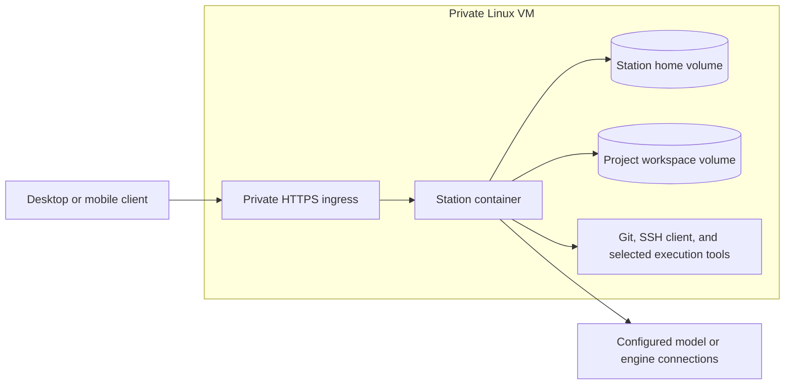

# Private cloud Station environment

> Status: working deployment design for one operator and one private Linux VM.
> Cloud provisioning, workload sizing, and backup/restore drills are not yet
> validated. [Deployment](../guides/deployment.md) owns supported commands and
> ingress behavior. This design does not establish a multi-user service.

## Initial shape

Run one Station runtime per home. Clients pair with that environment; paths
such as `/workspace/repository` refer to files on the VM. Persist the home and
projects outside the container's writable layer. Keep a stable Compose project name per
environment so moving deployment files does not silently select new named
volumes. Replacing an image should
preserve projects, uncommitted work, authentication state, and managed profiles.
Docker volumes supply persistence independently of container lifetime;
see [Docker's volume reference](https://docs.docker.com/reference/compose-file/volumes/).

Keep the application image immutable and pin the selected release by digest
for a deployment. The image's own dependency installation must remain separate
from host development dependencies and project-specific tools.

## Working environment contract

A cloud environment needs more than an HTTP listener:

- The service runs as UID/GID 1000 and can create files in its workspace.
- Git operations execute against a real repository, and PTYs execute as the
  same unprivileged user that owns the environment.
- Identity matches the selected image and live backend readiness succeeds.
- A replacement container retains its volumes, existing authentication, project
  records, workspace files, and Git history.
- Logs are bounded, shutdown gets a deliberate grace period, and failed health
  checks are visible to the operator.

The container smoke workflow exercises these contracts. A passing smoke is a
foundation check, not proof that every agent CLI, language toolchain, or workload
fits the VM.

## Tooling and execution

The base runtime includes Git, an OpenSSH client, certificate trust, Node, and
Station's terminal support. Add the specific language toolchains and agent CLIs
required by the workload through a versioned environment image or an explicit
remote execution target. Do not imply that every external engine is installed
or authenticated merely because Station supports its protocol.

Keep managed engine profiles under their existing Station-home contract. Any
additional SSH configuration, credential source, or cache needs an explicit
mount and retention decision. Do not bake credentials into a reusable image.
Git identity and SSH host verification remain operator choices.

Project commands run with the container user's authority. The application and
workspace are not separate security domains inside this single container. For
untrusted workloads or multiple users, plan separate execution workers with
narrow data mounts, scoped credentials, independent quotas, and lifecycle
control. A shared home or request-routing tenant label is not that boundary.
Do not add the host Docker socket as a convenience worker-launch mechanism;
its authority requires a separate design and review. See
[Docker daemon security](https://docs.docker.com/engine/security/#docker-daemon-attack-surface).

## Access and operation

Keep the Compose loopback binding and use a same-host HTTPS proxy or deliberate
private-network ingress. Preserve the one public origin, exact allowed origins,
WebSocket upgrades, and streaming behavior described in the deployment guide.
Use host-approved device pairing rather than exposing a reusable environment
credential in links or logs.

Set CPU, memory, and PID limits after exercising representative workloads.
Containers have no resource limits by default, so a provider's VM size alone is
not an application quota. See [Docker's resource guidance](https://docs.docker.com/engine/containers/resource_constraints/).
Monitor both container output and application-data growth; rotating Docker logs
does not bound every file Station or a project writes.

A Docker health check reports health; restart policy handles process exit.
Use monitoring or an explicitly chosen supervisor to act on an unhealthy
process that remains running. Do not assume an unhealthy label restarts it;
[Docker restart policies](https://docs.docker.com/engine/containers/start-containers-automatically/)
act on container exit and daemon restart.

## Backup and replacement

1. Record the immutable image and runtime identity, and finish or pause work.
2. Stop the Station writer before using the existing inactive-home backup
   contract. A live filesystem copy is not a SQLite-consistent backup.
3. Back up the project workspace separately, including uncommitted files and
   Git metadata. Home-only backup does not preserve those files.
4. Retain required external credential/key material through its own secure
   storage procedure. Encrypt off-host backups and restrict access.
5. Restore into an isolated environment and verify identity, authentication,
   project files, Git operations, and representative work before replacing the
   original. Keep only one active writer for a restored home.

A provider-specific VM template and a measured restore drill are the next
validation steps. An autoscaled multi-user service requires additional data,
credential, authorization, execution, and admission boundaries.
