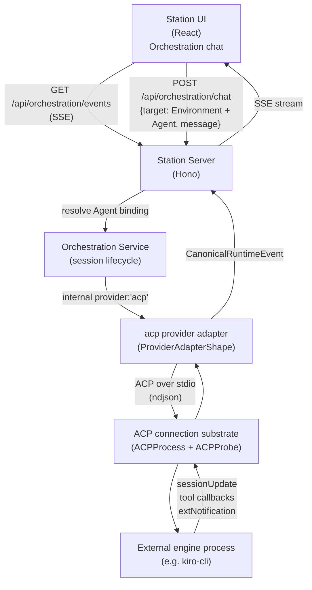

# Agent Communication Protocol (ACP) Guide

ACP is a **connection method** for [External agents](../glossary.md) — it lets Station drive an external agent app (like `kiro-cli`) as a subprocess over stdio, the same way it drives Claude Code or Codex over their native SDKs. ACP is not a separate agent type; it is just *how* Station is wired to that Agent app connection.

This guide is for developers who want to connect their own external engine to Station.

---

## What is ACP?

Station is a UI and session-management layer. It handles conversations, memory, tool approval, and streaming responses. ACP is the protocol that lets an external engine plug into all of that as an Agent app connection.

When an ACP connection is active, Station:
- Spawns the external engine process (or connects to one)
- Translates ACP protocol events into Station's canonical runtime event contract
- Exposes each connection as one External agent in the agent registry
- Proxies tool calls, file system access, and terminal execution through the bridge
- Persists orchestration session/turn events through the same pipeline every
  other provider uses (see [docs/reference/session-api.md](../reference/session-api.md))
  — not the retired `.station/agents/` conversation-record path (see
  [History note](#history-note-accepted-gap) below)

The external engine only needs to implement the [Agent Client Protocol SDK](https://github.com/agentclientprotocol/sdk). For a chat turn it never talks to Station's HTTP API directly.

One deliberate exception exists, and only for a runtime that opts into it by
advertising `mcpCapabilities.http` at `initialize`: Station may hand that
runtime a `type: 'http'` MCP server entry pointing at Station's own
loopback `station-control` MCP endpoint, which the runtime then connects to
itself. See
[Station-control over HTTP MCP](#station-control-over-http-mcp) below — it is
one named, credentialed, loopback-only endpoint, not general access to
Station's API.

---

## Architecture



There is no `.station/agents/` write path in this pipeline — that was the
pre-cutover chat-SSE substrate's persistence, retired (see
[History note](#history-note-accepted-gap) below). Orchestration session/turn
events are persisted through the orchestration event store instead, replayed
via `GET /api/orchestration/sessions/:threadId/events` (see
[docs/reference/session-api.md](../reference/session-api.md)).

There is no chat-SSE bridge anymore. ACP chats ride the same orchestration session/event pipeline as every other provider (Claude, Codex, Bedrock): the UI sends an Environment + Agent execution target, the server resolves the persisted Agent's ACP engine binding, and the `acp` provider adapter (`src-server/providers/adapters/acp-adapter.ts`, `ProviderAdapterShape`) drives the runtime over stdio using the ACP SDK's `ClientSideConnection`. Every runtime event — text, reasoning, tool calls, plan updates, app-specific notifications — is translated into a [Canonical runtime event](../glossary.md) before it reaches the UI. The adapter is the only place ACP vocabulary exists; nothing downstream of it (event handlers, chat UI, Plan panel) knows ACP is involved.

The connection-management substrate — `ACPProbe`, `ACPProcess`, `createACPBridgeClient`, and `ACPManager`'s probe-backed status/lifecycle tracking — is unchanged from before this cutover and is reused directly by the adapter. It is what backs the Connections Hub (`/acp/status`, `/acp/connections`, `/acp/registry`) and periodic availability probing; it is unrelated to how a chat turn is executed.

---

## Sessions

### Creation

When Station resolves a new execution for an ACP-bound Agent, the adapter:

1. Receives the server-resolved ACP connection binding (the raw connection id never comes from the UI request)
2. Spawns the configured command as a subprocess via `ACPProcess`
3. Calls `connection.initialize()` with `clientCapabilities` (fs read/write, terminal)
4. Calls `connection.newSession()` to create a fresh ACP session for the orchestration thread

### Connection Lifecycle (Connections Hub)

Independently of any chat session, each configured connection is periodically probed for availability by spawning a short-lived subprocess, calling `initialize()`/`newSession()`, then tearing it down. This is what backs the Connections Hub UI and `GET /acp/status`, and is unaffected by chat activity:

| Status | Meaning |
|---|---|
| `available` | Last probe succeeded — command found, handshake completed |
| `unavailable` | Last probe failed (command not found, handshake error, etc.) |
| `probing` | No probe has completed yet (first probe still in flight) |

## Agent List

Each configured ACP engine connection owns **one persisted default Agent** in the picker, not one per mode. For a connection configured with `id: "kiro"`, both the `EngineConnectionId` and its distinct `AgentId` have the clean text value `kiro`.

This is a deliberate, adapter-inherited scope reduction: the `acp` provider adapter's `ProviderAdapterShape` has no mode concept — `ProviderSessionStartInput`/`ProviderSendTurnInput` carry no `modeId` field, and the adapter never calls `ACPProcess.setMode()`. Per-mode virtual agents (the previous `{connectionId}-{modeId}` slug shape, e.g. `kiro-chat` / `kiro-agent`) could not be routed through the orchestration seam regardless of slug format, so collapsing to one agent per connection is the shape the adapter can serve today. Mode-switching support is filed as a follow-up, not silently dropped.

The agent entry still surfaces:
- `model` — current model name from the connection's config options
- `modelOptions` — available models if the runtime provides them
- `icon` — from the connection config
- `connectionName` — names the connection-derived Agent under its engine group in the New Chat picker

Image support is **not** carried on the Agent row. It was, as `supportsAttachments`, but no server code ever wrote that field — the composer read `undefined` and refused every image while the adapter declared `image-input` and built real image `ContentBlock`s (station#3344). It is now derived from two places that are actually written: the connection's `capabilities` (the adapter's own declaration, spread from `ACP_ADAPTER_CAPABILITIES`) and, for the per-connection answer, `capabilityInventory.sessionSurfaces.promptImage` — this connection's live `initialize` handshake reporting `agentCapabilities.promptCapabilities.image`.

The default exists independently of probe/readiness state. The Agent row carries explicit availability and reason fields; Station never encodes connection kind into the Agent ID.

---

## Message Flow

Sending a message to an ACP-connected agent is identical, from the UI's perspective, to sending a message to any other External agent:

1. The UI selects the persisted Agent row; it does not read or submit engine connection metadata.
2. The UI posts the Agent through `POST /api/orchestration/chat`; the server resolves the Agent's binding and supplies the ACP adapter with its connection ID — see [`docs/reference/session-api.md`](../reference/session-api.md).
3. A later turn uses the bound continuation endpoint. The `acp` adapter forwards it to the runtime via `connection.prompt()`.
4. The runtime's ACP session-update and extension notifications are translated by the adapter into [Canonical runtime events](../glossary.md) and streamed back over `GET /api/orchestration/events` (SSE), exactly like any other provider.

### Canonical Event Vocabulary

There is no bespoke ACP SSE-chunk vocabulary anymore. The adapter emits the same canonical event methods every provider emits — see `packages/contracts/src/runtime-events.ts` (the source of truth for shapes) and `docs/adr/0008-drive-acp-through-the-canonical-adapter-seam.md` for the design rationale. The methods most relevant to ACP sessions:

| Method | Purpose |
|---|---|
| `session.started` / `session.state-changed` / `session.exited` | Session lifecycle |
| `turn.started` / `turn.completed` / `turn.aborted` | Turn lifecycle |
| `content.text-delta` | Streaming text chunk from the agent |
| `content.reasoning-delta` | Streaming thought/reasoning chunk |
| `tool.started` / `tool.progress` / `tool.completed` | Tool execution |
| `request.opened` / `request.resolved` | Tool approval / permission requests |
| `plan.updated` | The agent's current ordered plan, as a full replace (see Plan Rendering below) |
| `extension.notification` | Namespaced, app-specific payload (see Extension Rendering below) |
| `runtime.error` / `runtime.warning` | Unrecoverable or recoverable error/warning |

Do not re-document per-field shapes here — read them from the contract file directly so this guide cannot drift out of sync with the code again.

### Plan Rendering

`plan.updated` events carry the agent's full, ordered plan (`entries: { content, status }[]`, a full replace, not a delta — mirroring ACP's own `plan` session-update shape without leaking ACP vocabulary into the canonical contract). Station feeds these events directly into the existing typed Plan surface: the CodingLayout's "Plan" inspector tab renders `ChatUIState.planArtifact`, which `plan.updated` populates with `source: 'canonical'` steps (no regex/heuristic text parsing — the entries are structured data end to end). A later `content.text-delta`/`content.reasoning-delta` event does not clobber a typed plan artifact with plain prose; the heuristic parser used by other providers only fills in when no typed artifact is already present.

### Extension Rendering

`extension.notification` events carry a namespaced, app-specific payload the canonical contract does not interpret (`namespace`, `type`, `payload: unknown` — ADR-0008: the canonical contract carries no app-specific semantics). Station renders two functional cases from Kiro's `_kiro.dev` namespace as ephemeral system messages in the transcript:

- `_kiro.dev/mcp/oauth_request` → a clickable **Open authentication page** link to the supplied URL when an MCP server the engine depends on needs the user to sign in.
- `_kiro.dev/compaction/status` / `_kiro.dev/clear/status` → a plain status line (`"Context compacted."` / `"History cleared."`).

Any other namespace or type is a no-op as an `extension.notification` transcript render — the canonical event surface intentionally does not grow app-specific rendering beyond these two evidenced, functional cases. A separate, narrower mechanism (below) does read one more shape of extension notification, but not to render it — only to enrich a later, otherwise-generic turn failure.

### Turn-failure enrichment from a co-reported notification

station#4084: a rejected `prompt()` can surface as a bare, uninformative error — a JSON-RPC `-32603` resolves to the literal string `"Internal error"` with no detail. Live evidence (kiro-cli, station#1860 verification): the engine had already sent `_kiro.dev/error/rate_limit` with `{ message: "The monthly usage limit has been reached" }` milliseconds earlier in the same turn, and that message was silently dropped.

The adapter retains an extension notification for this purpose only when it is bound to the `acp.turn-error-cause` consumer in the same **exact-tuple, evidence-backed registry** every other extension-notification behavior is driven from (`src-shared/extension-notification-bindings.ts`; see [Extension Rendering](#extension-rendering) above — "namespace similarity is never authority" is that registry's own rule, not a special case for this feature). Today that registry has exactly one such tuple: `_kiro.dev/error/rate_limit`. A structurally similar but unobserved tuple — a different `_kiro.dev/error/*` code, or an analogous notification from a different vendor — is **not** matched until it is itself observed and added with its own evidence, the same discipline `commands/available`/`oauth_request`/`compaction`/`clear` already follow. Sibling Kiro extensions that only carry an opaque `error: unknown` (e.g. `_kiro.dev/mcp/server_init_failure`, `_kiro.dev/agent/config_error`) were never candidates: there is no human-readable text to quote, exact tuple or not. The payload is still null-checked before its `message` field is read — a notification's `params` are not validated by the JSON-RPC layer, so a malformed or missing payload is treated as "no message," never as a crash or a fabricated cause.

Retention is also **suppressed** for a turn that starts while any interrupted (`interruptTurn`) prompt from this session has not yet settled. Extension notifications carry no turn id, so a notification arriving after a cancel cannot be proven to belong to the turn that's active by the time it arrives, or to the one that was just cancelled. This is decided **once, as a snapshot, at the moment the turn starts** — not by re-checking live per notification. A live per-notification check would let a turn's suppression lapse mid-window: the cancelled prompt's own settlement handler deletes its bookkeeping entry as soon as that prompt actually settles (purely so the bookkeeping set doesn't grow forever), and that deletion can land partway through a *later* turn's window — a notification delivered after it would then read as unquarantined even though its provenance is exactly as ambiguous as one delivered before it. So: if any interrupted-but-unsettled prompt exists for the session at the instant a turn starts, that turn's entire retention window is suppressed for its full duration, immune to the bookkeeping entry being cleared later. The ordinary `extension.notification` transcript event still fires as always; only enrichment retention is withheld, and only for the turn(s) where provenance was genuinely ambiguous when they started — nothing blocks the user from starting that turn, and a subsequent turn, begun once the ambiguity has cleared, retains normally. Retention is also capped at the last few notifications per turn, so a turn that never settles cannot grow the tracked list without bound.

If the turn then fails, the adapter's `runtime.error` message is enriched with the most recently retained notification's message, framed as **co-occurrence, not causation**: `"<original error> — engine also reported during this turn: <notification message>"`. Station observed the two events in the same turn window; it did not verify that the notification caused the failure, and the wording says exactly that. This mirrors the credential-refusal `runtime.warning` mechanism above — track what was actually received, then say so — rather than inventing a parallel path: nothing here is synthesized. A bare `-32603` with no prior bound notification in that turn's window still reports the generic error unchanged. The tracked notification list is reset to empty at the start of every turn and explicitly cleared again when a turn resolves — succeeds or fails. It is deliberately NOT cleared when a turn is interrupted: an interrupted turn's stray notifications are simply overwritten by the next turn's own start-of-turn reset, and the interrupted turn's suppression-snapshot mechanism above (not this list) is what stops a late one from being read in the meantime — so a notification never enriches a turn it wasn't received during.

### Inbound extension requests (agent → Station)

An agent may also send **extension requests** to Station over the same
mechanism. Station's answer is a spec-conformant refusal:

| Inbound | Station's response |
|---|---|
| Unrecognized extension **request** | JSON-RPC `-32601` (Method not found), plus a `warn` log naming the method and a `station.acp.inbound_extension_requests` increment |
| Unrecognized extension **notification** | Ignored (per spec) |
| A request naming a token or credential | `-32601`, always — see below |

The policy lives in `src-server/services/acp/acp-inbound-extension-policy.ts`
and is wired into both the chat adapter and the availability probe. There is
no default answer: **Station never returns a value it did not compute.** The
previous behavior (`onExtMethod: () => ({})`) replied to every inbound
extension request with an empty JSON-RPC *success*, which an agent reads as
"handled."

**No-credential-bridging invariant.** Station never answers an agent's
token/credential request. What enforces it, most load-bearing first:

1. **The allowlist is empty**, and filling it takes a reviewed code change.
   Nothing is answerable out of the box.
2. **Each call site owns a private registry** (one per session, one per
   connection) that no other code holds a reference to, so nothing can add a
   handler at runtime. Pinned by test.
3. **A credential-name tripwire**: `AcpInboundExtensionRegistry.register()`
   throws for a credential-shaped method name and `resolve()` re-checks at
   dispatch.

(3) is a **tripwire on the obvious vocabulary, not a proof of
completeness** — it misses `_vendor/session/refresh`, `_vendor/getAPIToken`
(the camelCase splitter breaks at `t|A`), non-English names, and
`_x/session/bootstrap`, which could return a credential without naming one.
It can only ever *deny*, never grant, so over-matching is free and
under-matching costs nothing while (1) holds. Do not read it as the
guarantee; (1) and (2) are.

Live motivation — this is a user-visible bug fix, not hygiene.
`_kiro/auth/getAccessToken` is Kiro's **host-mediated token-refresh
callback**: in ACP mode Kiro asks the *client* for a fresh access token
instead of re-reading its own still-valid on-disk credential
(kirodotdev/Kiro#10416). Under `--agent-engine v3` it asks eagerly, before
answering `initialize`; under the default engine it asks lazily, **on
expiry** — so a long Station chat previously received `{}` *as its refreshed
token* and then failed downstream in a confusing way.

Station holds `STATION_INTERNAL_API_TOKEN` and model-connection credentials
in the same process; an external agent is a less-trusted principal. And
Station holds no credential belonging to an engine at all: **Station does
not become an engine's auth host.** Answering that request is not a feature
to be added carefully — it is the thing that cannot be built.

A refused credential request also publishes one `runtime.warning` per
session per method (`code: acp.credential-request-refused`) telling the user
to sign in with the engine's own CLI and start a new chat, since a fresh
engine process re-reads the saved credential. It surfaces as a **5-second
toast plus a session-diagnostics row** — not a transcript message — so the
body is kept short and the method/connection ride `details`. The message
names that cause as *typical* and never asserts a diagnosis Station did not
compute.

### Measured effect of the refusal (live, `kiro-cli 2.16.0`, 2026-08-03)

`initialize` and `session/new` were driven against a real `kiro-cli` with
the client answering each way:

| engine | inbound ext requests | old `{}` | `-32601` refusal |
|---|---|---|---|
| default (`v2`) | **none** | initialize OK, session/new OK | initialize OK, **session/new OK** |
| `--agent-engine v3` | auth callback + `_kiro/terminal/shell_type` | initialize OK, session/new OK | initialize OK, **session/new FAILS** |

Two things follow, and both matter more than the intuition they replace:

- **Refusing the credential callback is survivable.** `initialize` completes
  fine after `_kiro/auth/getAccessToken` gets `-32601`.
- **What breaks `v3` is `_kiro/terminal/shell_type`** — an ordinary,
  non-credential extension request. Kiro propagates the client's `-32601`
  for it as the failure of the entire `session/new`. Station declares
  `terminal: true`, so Kiro is asking a follow-up about a capability
  Station really does advertise; Station has no contract for the response
  shape, and guessing one would be the fabrication this policy exists to
  remove. Tracked as a follow-up, where a reviewed allowlist entry is the
  correct home for it once the shape is known.

The default path is unaffected. `--agent-engine v3` is opt-in and cannot
start a session under this policy; that is disclosed rather than papered
over, and the probe and the chat path now agree — both fail, which is true.

Answering any inbound extension method at all requires a reviewed registry
entry. The registry is empty today.

**Error codes are emitted, never inferred.** Station emits `-32601` because
the spec says so, and derives nothing from the codes it *receives*: the
convention is not reliably observed in the wild (one vendor answers `-32603`
with vendor-internal detail for unknown methods; an older build of the same
binary answers `-32601` to everything, including its own documented methods).
See `docs/adr/0013-bind-agent-extensions-to-the-declared-mechanism-not-method-names.md`.

---

## Tool Execution

### Tool Calls (Runtime → Station)

When the runtime invokes a tool, the adapter translates the ACP `tool_call` session update into a `tool.started` canonical event, and subsequent `tool_call_update` notifications into `tool.progress`/`tool.completed` events — rendered by the same tool-activity UI every provider uses.

### Tool Approval (Runtime → User)

When the runtime needs permission before running a tool, it calls back via `requestPermission`. The adapter emits a `request.opened` canonical event (`requestType: 'permission'`), the UI shows the approval prompt, and the resolved decision is sent back to the runtime via `respondToRequest` on the adapter, mapped to the ACP `allow_once`/`reject_once` outcome.

### File System and Terminal Tools (Station → Runtime)

The adapter reuses `createACPBridgeClient`'s file-system and terminal callback handlers unchanged, so the runtime can read/write files and spawn subprocesses on the Station host exactly as before this cutover.

### Station-control over HTTP MCP

Station's built-in `station-control` MCP server is what lets the built-in
assistant operate Station itself (list agents, read config, and so on). It is
normally a child process Station spawns, authenticated with a process-local
env credential — a mechanism that cannot cross to an external agent app,
because an ACP `session/new` payload is handed to that app rather than
confined to a Station-spawned child.

Since station#1684 Station can deliver it to an ACP-connected external engine instead, over
HTTP. The rules, in full:

- **Gated on the live handshake.** Station delivers it only when *this*
  connection's `initialize` result advertises
  `agentCapabilities.mcpCapabilities.http === true`. There is no static
  per-CLI allowlist; the answer is read from your own handshake every
  session.
- **Delivered as an ordinary ACP MCP server entry.** It arrives in
  `session/new` (and `session/load`) `mcpServers` as
  `{ type: 'http', name: 'station-control', url, headers }`. Your runtime
  connects to it with an MCP HTTP client, exactly as it would any other HTTP
  MCP server. Nothing ACP-specific is required beyond supporting the
  transport.
- **`Authorization: Bearer <token>`.** The credential is in the header list,
  never in the URL — the URL carries no token at all. Present the header on
  every request to that endpoint.
- **Per session, and short-lived in a specific sense: 12 hours.** The token is
  scoped to one Station session, revoked when that session stops or fails to
  start, and otherwise expires 12 hours after it was minted. It is not a
  Station API key: it authorizes opening that one MCP endpoint and nothing
  else.
- **Loopback only.** The URL is always `http://127.0.0.1:<station-port>` —
  the runtime reaches it as a process on the same host, never remotely.
- **No retry if the capability is absent.** A runtime that does not advertise
  `mcpCapabilities.http` simply does not receive the entry. Station does not
  fall back to spawning the server over stdio, does not re-issue
  `session/new` with a narrower payload, and does not fail the session — the
  chat works, `station-control` is absent, and an
  `engine-capability-absent` receipt records why. Rejecting `session/new`
  because of this entry therefore ends the session start; it is not retried.

Authored (user- or agent-configured) tool servers are unaffected by this and
remain stdio-only. This is one named built-in server on its own reviewed
mechanism, not a general HTTP passthrough channel.

---

## Slash Commands

Slash commands are sent as **plain prompt text** — the adapter's `sendTurn` has no command-dispatch branch. There is no separate extension-namespaced RPC dispatch step anymore; the runtime is responsible for parsing `/command` syntax out of the prompt text itself, the same way any other agent app would.

### Static command listing

A static list of available commands is exposed through the generic, provider-agnostic orchestration route:

```
GET /api/orchestration/providers/acp/commands
```

This calls the adapter's `getCommands()` (`ProviderAdapterShape`), aggregating whatever slash commands the external engine connections have advertised. The UI's command-autocomplete hook consumes this the same way it would for any other provider that implements `getCommands()`.

### Accepted gap: per-keystroke argument autocomplete

`ProviderAdapterShape` has no equivalent of the old per-keystroke, per-agent argument-autocomplete endpoint (no `getCommandOptions`-style method exists on the shape). Option-fetching for ACP-connected Agents always resolves to an empty list today. This is an explicitly accepted, adapter-inherited gap — filed as a follow-up, not silently absorbed into the static command list.

---

## Configuration

### acp.json

ACP connections are configured in `<station-home>/config/acp.json`:

```json
{
  "connections": [
    {
      "id": "kiro",
      "name": "Kiro",
      "command": "kiro-cli",
      "args": ["acp"],
      "icon": "🤖",
      "cwd": "/path/to/project",
      "enabled": true
    }
  ]
}
```

| Field | Required | Description |
|---|---|---|
| `id` | ✓ | Clean unique engine-connection identifier; the owned default Agent uses the same text ID in the Agent namespace. |
| `name` | ✓ | Display name shown in the UI. |
| `command` | ✓ | Executable to spawn. Must be on PATH. |
| `args` | | Arguments passed to the command. |
| `icon` | | Emoji or string shown next to the agent name. Defaults to `🔌`. |
| `cwd` | | Working directory for the subprocess. Defaults to Station's cwd. |
| `enabled` | ✓ | Set to `false` to disable without removing the config. |

### Runtime API

Connections are managed at runtime via the REST API — unchanged by this cutover, since it only manages connection lifecycle, not chat turns:

```
GET    /acp/connections                List all connections with live status
POST   /acp/connections                Add a new connection
PUT    /acp/connections/:id            Update a connection (restarts it)
DELETE /acp/connections/:id            Remove and shut down a connection
POST   /acp/connections/:id/reconnect  Force reconnect a connection
GET    /acp/status                     Get status of all connections
```

### SSE Status Events

The `/events` SSE stream replays ACP connection status on connect and emits updates as connections change:

```
event: acp:status
data: {
  "connected": true,
  "connections": [
    { "id": "kiro", "status": "connected" }
  ]
}
```

The `agents:changed` event fires whenever the agent registry changes (e.g., after a successful connection).

---

## Troubleshooting

### Connection stays `unavailable`

The configured `command` was not found on PATH. Verify the binary is installed and accessible:

```bash
which kiro-cli
```

If the binary is installed but not on the server's PATH, use an absolute path in `command`.

### Connection stays `connecting` or goes to `error`

Check server logs for `[ACPProcess]` entries and `ACPProbe failed` warnings. Common causes:

- The subprocess exits immediately — run the command manually to see its output
- The runtime doesn't speak ACP ndjson on stdio — verify it implements the ACP SDK server side
- Protocol version mismatch — the adapter sends `PROTOCOL_VERSION` from the ACP SDK; ensure the runtime supports it

### Agent not appearing in the New Chat picker

Every configured connection should surface as one External agent with the same clean ID, even while disabled, unprobed, unavailable, or in error. If it is missing, inspect `config/agent-registry.json` and the connection lifecycle error; probe state should change availability, never Agent existence.

### Every orchestration session starts a fresh ACP session

The adapter always calls `connection.newSession()` when an orchestration session starts for an ACP-connected agent — it does not call the ACP SDK's `loadSession` to resume a runtime-native session across Station restarts. Each orchestration `threadId` maps to exactly one ACP session for its lifetime; there is currently no cross-restart ACP session resumption wired through the adapter.

### Reconnect loop

If the subprocess keeps exiting and reconnecting, check:
- The subprocess is not crashing on startup (run it manually)
- `maxReconnectAttempts` may be exhausted — after repeated failures the connection stops retrying and stays in `error` state. Restart Station or use `POST /acp/connections/:id/reconnect` to trigger a fresh start.
