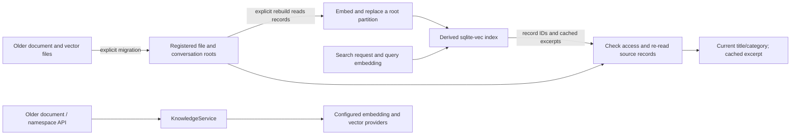

# Knowledge: stores and the retrieval index

Station's knowledge system has two layers. They are separate on purpose, and understanding the
split is the key to everything else in this guide — see
[ADR-0009](../adr/0009-treat-knowledge-stores-as-canonical-and-index-as-derived.md) for the full
rationale ("why sqlite-vec") and [docs/design/knowledge-foundation.md](../design/knowledge-foundation.md)
for the implementation contract.

## Agent tools

Add **Station Knowledge** in an agent’s Tools tab to read and capture records.
The Station role includes it by default. This small MCP contains
`list_knowledge_roots`, `list_knowledge_records`, `get_knowledge_record`,
`add_knowledge_record`, and `search_knowledge`. Search needs an embedding
connection; listing and reading records do not.

Station Control retains index rebuild and migration controls, plus its existing
search tool for compatibility. Capture creates a new raw record and never
replaces a record. A session’s owner must have access to the selected store;
Project writes also require edit access. Personal stores belong to the local
operator. Session-backed conversation stores remain read only.

Claude receives an in-process server. Codex and ACP receive separate,
short-lived Knowledge credentials for the local HTTP endpoint; ACP requires
observed HTTP MCP support. Native agents use a local HTTP connection only
inside an active, authorized turn. Credentials are scoped to the session and
server, and session stop revokes them. HTTP custody does not claim bound
session attribution; capture records its assurance and omits a session ID
unless the connection is bound. Per-tool restrictions retain the engine’s
existing support limits, including ACP’s refusal of individual selections.

The [data tool registrations](../../src-server/tools/station-knowledge-tools.ts)
and [native caller bridge](../../src-server/runtime/mcp/station-knowledge-native-tools.ts)
own these paths.

## Two layers: store vs. index

**Store records are authoritative.** File-backed roots use Station adapters
that implement the Knowledge Kit's published record and file-format contracts.
The default adapter writes Markdown records and indexes; the Obsidian adapter
uses a vault layout. A derived conversation root is different: it reads
Session history rather than owning another set of Markdown records.

Creation assigns a new identity. Station's optional caller-supplied `id` must
also be new: the default and Obsidian adapters refuse an existing ID, including
a retired record, instead of replacing its body, creation provenance, mutation
history, aliases or links. A duplicate create is an invalid input (HTTP 400).
For Obsidian, an index miss alone does not prove that an ID is unused. Creation
checks physical Markdown identities, including archived records, inside the
same file transaction. It refuses unreadable or inconsistent indexed records,
unindexed record-like frontmatter (both `type` and `provenance`), malformed
frontmatter, symlinked or unsupported directory entries, and occupied unindexed
destination paths. These identity checks refuse before publishing the create
and do not repair the path index. The shared transaction owner can still recover
an earlier interrupted write before checking the new request. The current reindex command rebuilds graph/alias indexes
from path-index entries and cannot recover a lost path index.

The physical inspection admits at most 10,000 directory entries, 16 MiB per
Markdown file and 64 MiB of Markdown in total. Exceeding a bound or being unable
to establish identity returns storage-unavailable (HTTP 503), rather than
creating over uncertain data. Ordinary unindexed notes can remain in the vault,
but creation will not overwrite them. These are coordinated transaction checks,
not a lock on edits made outside Station.

After an uncertain create response, read that exact ID and compare the intended
record before deciding what remains to do. Use the adapter's evidence-bearing
update/link operations for an intentional change, not another create request.

**The retrieval index is derived.** The store/index routes use the built-in
`sqlite-vec` provider at `<STATION_HOME>/knowledge-index/index.db`. It stores
vectors, chunk text, metadata, and references to source records. It is a copy
for retrieval, not the authority for record content. Search resolves each hit
through the owning adapter before returning it, but its excerpt still comes
from the index and can lag an edited record.

Station also retains the older per-Project document/namespace API through
`KnowledgeService`. That service uses configured embedding and vector
providers. It is not the same interface as the store/index routes described
here; the migration section explains how their data is related.

For a concrete example, [browse Station's repository graph](repository-knowledge-graph.md)
or see [the captured Knowledge Library](../learn/walkthroughs.md#explore-repository-knowledge).
That journey uses canonical records and links without an embedding service.

[KnowledgeStoreProvider](../../src-server/knowledge-store/knowledge-store-provider.ts)
owns registered roots and adapters. [Runtime route composition](../../src-server/runtime/routes/runtime-routes.ts)
selects `sqlite-vec` for the store index, while
[KnowledgeService](../../src-server/services/knowledge/knowledge-service.ts)
resolves the older API's providers through injected functions.



The arrows show data flow. They do not imply automatic indexing or that every
caller may read or rebuild every root.

## `./station knowledge reindex` — (re)build the index

Run this any time you want the semantic-search index brought up to date with what's currently in
your knowledge stores — after a bulk import, after editing store files directly outside Station, or
just because you deleted the index file and want it back.

```bash
./station knowledge reindex
```

Rebuilds every registered store root. Example output:

```
Reindexed root root:personal: 42 record(s), 118 chunk(s).
Reindexed root root:project-station: 17 record(s), 53 chunk(s).
Knowledge reindex complete: 2 root(s), 59 record(s), 171 chunk(s).
```

Scope it to a single root with `--root`:

```bash
./station knowledge reindex --root=root:project-station
```

```
Reindexed root root:project-station: 17 record(s), 53 chunk(s).
Knowledge reindex complete: 1 root(s), 17 record(s), 53 chunk(s).
```

Rebuilding is safe to run repeatedly — it always walks the store from scratch and replaces the
root's index partition, so re-running it on an already-current root just re-derives the same
result rather than erroring or double-counting.

### The rebuildability property

Use `reindex` to rebuild from the registered roots with the currently selected
embedder. The provider reads and embeds a root before replacing that root's
rows, so an embedding failure does not first erase the existing partition.
Later write failures can still leave an incomplete rebuild; inspect each
root's result. A multi-root request can return HTTP 200 with some failed roots,
and the CLI prints their failures alongside successful counts. The CLI does
not set a failure exit code solely because some roots failed; inspect the
per-root report rather than treating exit zero as an all-roots success.

The index is rebuildable when its source records and an appropriate embedder
are available. This does not mean it repairs itself automatically: rebuild and
migration are explicit requests, not startup jobs. Do not remove an open
SQLite file from a running Station. If corruption prevents a rebuild, stop the
processes using that runtime home before an operator archives the derived database and its
sidecars; preserve the source stores. `STATION_HOME` alone does not retarget a
CLI API call—check `./station target` or pass `--station=<name>`.

The [lossless-rebuild tests](../../src-server/knowledge-index/__tests__/lossless-rebuild.test.ts)
compare results with stable fixture records and embeddings. They do not promise
identical ranking after source edits or a model change.

### Changing the embedding model

The index records vector width, not the embedding provider/model identity.
A write with a different width drops and recreates the shared vector table,
emptying every root's partition and clearing their rebuild timestamps. A
search with the wrong width fails rather than rebuilding automatically.
Changing to another model with the same width is not detected.

After changing an embedding provider or model, run
`./station knowledge reindex` without `--root` to rebuild all roots. A rebuild
restricted to one root is isolated only while the vector width stays the same.
[The index implementation](../../src-server/knowledge-index/sqlite-vec-index-provider.ts)
owns these rules.

## `./station knowledge migrate` — bring in pre-store knowledge

Before knowledge stores existed, per-project knowledge lived in an older, project-scoped vector
store (`{dataDir}/vectordb/<namespace>/vectors.json`) paired with a document tree
(`{dataDir}/projects/<slug>/knowledge/<namespace>/`). If you have any projects from that era, use
`migrate` to bring that data into the new store + index world.

```bash
./station knowledge migrate
```

Example output when there are pre-index documents or vectors to migrate:

```
Knowledge migrate complete: 12 document(s), 34 chunk(s) across 1 namespace(s) (project-acme).
```

Or, if no pre-index content is found (the common case for a project created after knowledge stores
shipped, or a fresh `~/.station` home):

```
Knowledge migrate: no pre-index documents or vectors found (no-op).
```

Scope it to a single project with `--project`:

```bash
./station knowledge migrate --project=acme
```

Migration reuses existing vectors when their dimensions match the current
embedder and the source chunks are available. This is a width check, not proof
that the same model produced them. Missing or incompatible vectors trigger a
root rebuild. Run a full reindex after changing the embedding model, including
a change to one with the same width.

### The non-destructive guarantee

Migration copies records into a project Knowledge store and builds its index.
It leaves the source corpus in place and does not switch the older API to the
new root or clean up the old directories.

Reading the source first enters its normal transaction-recovery gate. If an
earlier write was interrupted, that read can restore or remove files from the
pending operation and clean up its journal. Thus source snapshot acquisition
is not a zero-write inspection. The migration's own writes target the new
store and derived index; healthy source files are retained.

Re-running migration skips destination record IDs that already exist and can
copy newly discovered records. It may write index rows again, allowing a
record-create/index-failure boundary to recover without another record write.
It does not synchronize later edits to an already-migrated record. Keep the
older data until you have checked the imported records; any later cleanup is a
separate operator action.

## Local vs. project scope

A root is tagged `personal` or `project`; a Project root names its Project slug.
The registry can allocate suffixed IDs such as `root:personal:2` or
`root:project-example:2`, and the runtime's read-only conversation root also has
personal scope. The current Settings card displays the first personal root;
its one-card UI is not a server-enforced uniqueness guarantee.

The vector table partitions entries by root ID. A scoped query restricts that
partition, but authorization is a separate boundary. Conversation-backed reads
recheck the caller's Session access. Agent-originated searches also check
whether the Session owner may read the root before resolving its records.
Rebuilding conversation-backed roots is restricted to the local operator and
runs through the Station indexer; an ordinary partial reader must not replace
the shared index with only their own visible subset.

## Searching: `./station knowledge search`

Once a root is indexed (via `reindex`, above), search it from the CLI:

```bash
./station knowledge search "release pipeline failure" --top-k=5
```

Scope it to one root with `--root`, same flag as `reindex`:

```bash
./station knowledge search "release pipeline failure" --root=root:conversations
```

Each result names the matched record's root, title, category, score, and a text excerpt — the same
`POST /api/knowledge/index/search` route the Ask tab (below) and the `search_knowledge` station-control
MCP tool both call. The route re-reads each record through its adapter and
returns the current title/category with the cached excerpt and score. Missing
or inaccessible records are omitted. There is no generic body-version comparison
or active-status check in this route: open the source record for its current
body and lifecycle, and reindex after edits when you need fresh excerpts.

## `root:conversations`: past conversations as a knowledge root

Station's own conversation history — everything under `station runs`/the chat history, both
native-SDK (Claude/Codex) sessions and managed-runtime chats — is itself registered as a read-only
knowledge store root, `root:conversations`, when the `knowledgeStores` setting is on in a personal-host runtime. Hosted
tenant runtimes suppress this root. This means
`./station knowledge search`/`search_knowledge` and the K3 index cover past conversations the same
way they cover any other root: no separate "search my chat history" surface to learn.

Two things make this root different from a personal or project store:

- **Read-only.** `root:conversations` is a derived projection, not somewhere you write new records.
  Every mutation (create/update/link/etc.) is rejected — the CLI/API surfaces this as an HTTP 405,
  not a generic error.
- **Freshness is explicit, same as any other root.** New or updated conversations do not
  automatically appear in search results — run `./station knowledge reindex --root=root:conversations`
  (or a plain `./station knowledge reindex`, which covers every root) after conversations you want to
  find have happened.

See [docs/design/knowledge-foundation.md](../design/knowledge-foundation.md)'s "Derived read-only
roots" note for the implementation detail (canonical source, the `READ_ONLY` error code, and how
this differs from a Kit-format file-tree adapter).

## Optional setup in Settings

Everything above describes the store/index model once it exists. This section covers how a new
Station user actually gets a knowledge store in the first place, without reading any of it.

### Settings: My knowledge store

Settings has a **My knowledge store** section that displays the first personal
root returned by the server. A personal root is available outside a particular
Project; whether an Agent can read or write it depends on its tools, engine,
authority, and the adapter (conversation history is read-only). Knowledge is
optional: Station does not show a global setup prompt or create/import a store automatically.

**Creating one is a single click.** If you don't have a personal knowledge store yet, the section
shows a "Create recommended store" action. There's no path to type: the server defaults the
location to `{dataDir}/knowledge/personal` (typically `<STATION_HOME>/knowledge/personal`) and uses the
built-in Kit default-store adapter. Once it exists, the section shows its location, display name, and
adapter instead of the create action.

**Connecting an existing Obsidian vault.** Instead of creating a fresh store, you can connect a vault
you already keep in Obsidian, via the "Connect an existing Obsidian vault instead" affordance (only
offered while there is no personal knowledge store yet — this form stops offering creation once it finds a personal root). Enter the vault's path, then run "Validate" before "Connect" becomes available. Validation
checks that the path exists, is a directory, and looks like a real vault (it has an `.obsidian/`
folder, or is simply non-empty). An honest failure — a missing path, a path that isn't a directory,
or an empty directory with no `.obsidian/` marker — is shown as a named error with the real reason
(e.g. "storeRoot is an empty directory with no .obsidian/ vault marker"), never a generic "something
went wrong" message and never silently creates a fresh store instead. Only once
validation reports success does "Connect" register the vault as your personal knowledge store.

**Changing a registered store is not migration.** The current registry contract has separate
create and deregister operations but no atomic replace operation. Settings therefore does not offer
a change action that could briefly remove the active store or register two personal stores. A future
redefinition flow must validate and atomically switch the registered target while preserving the
old store and every file. Copying records between stores is a separate migration operation and must
not be implied by a registry switch.

Note the noun: the thing Station manages is a **knowledge store**; "vault" is reserved for the
Obsidian-specific folder structure you're pointing it at.

### Project settings → Knowledge store

Each project's Settings has its own "Knowledge store" subsection (alongside the earlier per-project
document-upload panel), for that project's **project-scoped** knowledge store:

- **Create a project knowledge store** — same one-click pattern as the personal store: no path to
  type, the server defaults the location to `{dataDir}/projects/<slug>/knowledge-store` using the Kit
  default-store adapter.
- **Migrate this project's existing knowledge** — shown only when the project has knowledge from
  before knowledge stores existed (the earlier per-project document upload panel has files in it).
  This button runs the [migration described above](#the-non-destructive-guarantee).
  It does not cut over or clean up the source corpus, but source reading can
  recover an interrupted earlier transaction before records are copied.

## Knowledge Library: general, read-only recall

**Knowledge Library** (`examples/knowledge-library/`) is the general Station surface for browsing
registered Knowledge Kit roots. It is an installable plugin, not a new store or a replacement for
the Knowledge Kit. Use it when you want recall without entering a domain app such as Meeting Notes.

The plugin deliberately keeps the two-layer authority boundary visible:

- its record list comes from the root-derived graph and is labeled as derived navigation;
- selecting a node resolves the canonical record again through that root's adapter;
- lifecycle, expiry, body, provenance, and links come from that canonical record response;
- it sends no knowledge mutations, index rebuilds, root changes, or Neo4j synchronization requests.

It shows personal roots plus roots for the active project only. Root choice stays explicit, so the
surface does not invent an automatic recall-routing policy. If there is no relevant root, it links
to `Settings → Knowledge` instead of showing an empty successful graph. A graph failure and a
canonical-record failure remain distinct visible errors.

From the repository root, build and install it like the other examples:

```bash
npm run dependencies:ci
npm run build --prefix examples/knowledge-library
./station plugin install examples/knowledge-library
```

The final public product label may later become **Learn** as part of the unified Task experience.
`Knowledge Library` names this standalone pilot; it does not ratify the cross-product navigation
label.

## Meeting notes: capture and recall

**Meeting Notes** (`examples/meeting-notes/`) is the first real app built on the store/index model
above — Knowledge K5 (issue #203). It is an installable plugin, not core: everything it does goes
through the two layers this guide already describes (Kit records in a knowledge store, a
retrieval index for search) plus one optional addition, a Neo4j-backed graph view. Read this section
as a worked example of the store/index model, not a third layer.

### Install it

From the repository root (see [plugin authoring](./plugins.md)):

```bash
npm run dependencies:ci
npm run build --prefix examples/meeting-notes
./station plugin install examples/meeting-notes
```

Once installed, open the **Meeting Notes** layout in a project (or your personal workspace). It
needs at least one registered knowledge store — create your personal one first via
**My knowledge store** in Settings if you haven't already (see
["Optional setup in Settings"](#optional-setup-in-settings) above). The layout has
three tabs: **Capture**, **Library**, and **Ask**.

### Capture: transcript → raw record → compiled note

The **Capture** tab has a root picker (your personal knowledge store, plus the active project's, if
any — manual choice only, nothing is auto-selected), a transcript textarea
for pasted text or an uploaded `.txt` file, and two actions. Live recording is
currently unavailable through the public SDK: the optional recording component
requires `useSTT`, which this checkout does not export. Browser speech support
alone cannot enable it.

- **Save transcript** trims surrounding whitespace, then writes the text as a `raw` Kit record
  (`provenance.agent: 'station.meeting-notes.capture'`).
- **Compile** sends that transcript to a plugin-contributed agent (the same "extract the key action
  items, decisions made, and any important points" prompt already dogfooded by
  `examples/meeting-transcription/`), then writes the structured result as a `compiled` record whose
  `links` includes `{ target_id: <raw record's id>, kind: 'source' }` and whose
  `provenance.source_ids` names the same raw record. The ordinary workflow saves
  first, then compiles using the retained ID. The compile call does not re-read
  or lock that source record, so this reference is not proof that the source
  still exists or that its text matches the current textarea. An external edit
  or a late save response can break that correspondence; inspect the saved raw
  record when checking the compiled note's provenance.

Both writes go through the K2 store seam described above — nothing about capture bypasses the
adapter contract or invents a parallel storage format. See
`examples/meeting-notes/src/CaptureModal.tsx` and `examples/meeting-notes/src/compile.ts` for the
exact record shapes.

### Library: the wikilink graph

The **Library** tab renders the selected knowledge store's records as a wikilink graph — one node
per Kit record (grouped in rings by type: raw, compiled, concept, snapshot, person), one edge per
forward link. Click a node to see its title, type, category, a body excerpt, and its own outgoing
links; clicking a linked node re-selects it, so you can walk a provenance chain (compiled note →
its raw transcript, and onward) without leaving the pane.

**Files vs. Neo4j: which graph you're looking at.** Every knowledge store root has a file-based
graph view for free — `GET /api/knowledge/roots/:rootId/graph` derives it directly from the store's
own records and their `links` fields (`src-server/routes/knowledge/knowledge-record-routes.ts`), no extra
setup required. This is what the Library tab renders today
(`examples/meeting-notes/src/GraphPane.tsx`'s `useKnowledgeGraphQuery(rootId)`).

Separately, a root can also be synced into a real **Neo4j** graph database as an opt-in, read-side
"graph view" — the same graph data, materialized in Neo4j for genuine graph queries (a shortest-path
provenance-chain lookup between two records, for example) rather than a re-derivation from files
each time. The graph connection is registered in the server process. It must be registered
again after a restart; it is not a durable Settings connection. Its graph is a
derived copy of record data: your
knowledge store's files stay the single source of truth on `kit-default-store` or
`kit-obsidian-store`; Neo4j only ever mirrors what's already there. The relevant server routes
(`src-server/routes/knowledge/neo4j-graph-routes.ts`: `POST .../graph/neo4j-sync`,
`GET .../graph/neo4j`, `GET .../graph/neo4j/shortest-path`) are wired into the Library tab as a
**Files / Neo4j view** toggle (`examples/meeting-notes/src/GraphPane.tsx`) — switching to "Neo4j
view" calls `useKnowledgeGraphNeo4jQuery(rootId)` (only once you actively select that view, never
alongside the file-based graph by default) and a "Sync now" button triggers
`useSyncKnowledgeGraphNeo4jMutation()`, reporting the returned node/link write counts. `curl`/script/
Kit-CLI access to the same routes remains equally valid — the toggle is a UI convenience over the
same API, not a replacement for it.

**What "Neo4j graph view isn't configured" means.** Every one of those Neo4j routes answers an
honest `503` with that reason whenever no connection is registered — which is the default, out of
the box, on every Station install. Nothing about knowledge stores, capture, or the file-based
Library graph requires Neo4j; it is purely optional. "Not configured" specifically means no process
has called `registerNeo4jGraphViewConnection(...)` (`src-server/knowledge-store/neo4j-connection.ts`)
yet — there is no Settings toggle for this in this landing, so registering a connection today is a
per-process programmatic/operational step (see `neo4j-connection.ts`'s `Neo4jGraphViewConnectionConfig`
shape below), not a user-facing form.

**How to configure it.** Register a connection with (server-side; module path
relative to the Station repo root — this is not something a plugin or
browser client calls, it runs in-process on the Station server):

```ts
import { registerNeo4jGraphViewConnection } from './src-server/knowledge-store/neo4j-connection.js';

registerNeo4jGraphViewConnection({
  uri: 'neo4j://localhost:7687', // or bolt://, neo4j+s://
  username: 'neo4j',
  password: process.env.NEO4J_PASSWORD, // never hardcode credentials
  database: 'neo4j', // optional; defaults to the driver's own default database
});
```

Then, for a given root, trigger a sync and read it back:

```bash
# Set the selected Station origin and an authorized credential first.
# These variables must describe the same Station you configured above.
curl --fail-with-body -X POST \
  -H "Authorization: Bearer ${STATION_BEARER:?set an authorized credential}" \
  "${STATION_API_BASE:?set the Station origin}/api/knowledge/roots/root:personal/graph/neo4j-sync"
curl --fail-with-body \
  -H "Authorization: Bearer ${STATION_BEARER}" \
  "${STATION_API_BASE}/api/knowledge/roots/root:personal/graph/neo4j"
curl --fail-with-body --get \
  -H "Authorization: Bearer ${STATION_BEARER}" \
  --data-urlencode 'fromId=<compiled-record-id>' \
  --data-urlencode 'toId=<raw-record-id>' \
  "${STATION_API_BASE}/api/knowledge/roots/root:personal/graph/neo4j/shortest-path"
```

Sync projects record type, title, category, and links—not record bodies. It
writes nodes before edges so forward references can resolve. Hash checks avoid
rewriting unchanged projected fields. It does not prune old nodes or edges when
source records/links disappear, so a Neo4j view can retain stale graph structure.
The [sync implementation](../../src-server/knowledge-store/neo4j-graph-sync.ts)
also performs sequential per-record/link queries; large stores can need many
round trips. See
[the example's optional Neo4j developer surface](../../examples/meeting-notes/README.md#optional-neo4j-developer-surface)
for its connection-registration and live-test prerequisites. A running database
alone does not configure the Station process's graph connection.

### Ask: retrieval-grounded Q&A

The **Ask** tab is a search box over the retrieval index described earlier in this guide, scoped to
your personal store plus the active project's — not a chat. Type a question, submit, and each result
comes back as an excerpt card: title, category, the matched text, a relevance score, and a "View
source record →" affordance that opens the full record (title, type, category, and body) inline.
There is no generation step: nothing here composes an answer for you, it only finds and cites. If
you want the exact wording behind an excerpt, follow its source link — every excerpt is traceable
back to the Kit record it came from (`examples/meeting-notes/src/AskPane.tsx`, backed by
`POST /api/knowledge/index/search`, `src-server/routes/knowledge/knowledge-index-routes.ts`).

**The no-embedding-connection state.** Search embeds your query text before it can match anything,
so it needs an embedding-capable Model connection configured (the same requirement
`./station knowledge reindex`/`migrate` already have, described earlier in this guide). If none is
configured, Ask shows an honest "No embedding model configured" state with a direct link to
`Connections → Models` — never a silent empty-results screen. Once you configure one, existing
records still need an index before they are searchable. Run
`./station knowledge reindex` after capturing, compiling, or editing records.
The current route composition has no record-change subscriber that automatically
updates this index.

## Where Knowledge Kit comes from

Knowledge Kit ships inside the `@kontourai/flow-agents` npm package, in its
[Knowledge Kit directory](https://github.com/kontourai/flow-agents/tree/9696ff6844ca21f81d95efe0885f1bd43dbe02b1/kits/knowledge).
It is not a separately released npm package. Its
[manifest](https://github.com/kontourai/flow-agents/blob/9696ff6844ca21f81d95efe0885f1bd43dbe02b1/kits/knowledge/kit.json)
declares flows, adapters, provider entry points, tests and skills. The package
release identifies the bundled Kit bytes; the manifest's `schema_version`
identifies the manifest format. Neither should be treated as a promise that
Station implements every addition to the store contract.

There are three separate parts to an update:

| Part | How it changes |
| --- | --- |
| Bundled Kit | Upgrade the pinned Flow Agents package to obtain that release's Kit. |
| Workspace Kit copy | Run that version's `flow-agents kit install knowledge --dest <bundle-root> --update`; inspect `kit status knowledge --dest <bundle-root>` for the recorded and observed content hashes. |
| Station adapters | Change and test Station's implementation of the published contract through the normal Station release process. A Flow Agents upgrade does not replace these adapters. |

The [Kit installer](https://github.com/kontourai/flow-agents/blob/9696ff6844ca21f81d95efe0885f1bd43dbe02b1/src/cli/kit.ts)
resolves `knowledge` through its bundled catalog. A first install uses the same
command without `--update`. Use an explicit destination: it is a Flow Agents
bundle root, not the directory holding your knowledge records. Installation
copies the Kit and records its content hash; activation of agent/runtime
projections is a separate operation. See the
[Kit authoring and installation guide](https://github.com/kontourai/flow-agents/blob/9696ff6844ca21f81d95efe0885f1bd43dbe02b1/docs/kit-authoring-guide.md).

Station's normal store path is **UI or agent → public SDK/API →
KnowledgeStoreProvider → Station adapter → records and indexes**. The
[runtime bootstrap](../../src-server/runtime/bootstrap/runtime-service-bootstrap.ts)
creates the provider, and the
[store routes](../../src-server/routes/knowledge/knowledge-store-routes.ts)
call it. These requests do not launch the Flow Agents CLI. The Kit supplies
the shared storage contract; Station owns request authorization, registered
roots and its adapter behavior.

A separate consumer can load an installed Kit's manifest-declared provider
entry. That is how the [repository graph interoperability check](repository-knowledge-graph.md#kit-consumer-dogfood-and-release-boundary)
reads Station's copied records. It does not make the Kit provider a Station
runtime dependency. That check also records fixes still awaiting publication;
a locally tested candidate is not a published release.

## Store formats and external edits

The [default file adapter](../../src-server/knowledge-store/adapters/default-store.ts)
and [Obsidian adapter](../../src-server/knowledge-store/adapters/obsidian-store.ts)
are Station-owned implementations of the published Knowledge Kit format.
They do not import the Kit's private adapter modules. The checked-in
[record contract](../../packages/contracts/src/knowledge-store.ts) and
[shared conformance tests](../../src-server/knowledge-store/adapters/__tests__/contract-suite.ts)
define the behavior Station tests; this is not a promise of compatibility with
every future Kit version.

| Adapter | Records and indexes |
| --- | --- |
| Default file | `records/<id>.md`, plus `graph-index.json` and `alias-index.json` |
| Obsidian | Person records under `people/`; concept/snapshot records under category paths; raw/compiled records under the category's sources directory; superseded records under `archive/`; graph, path, and alias indexes |

Obsidian record bodies can contain arbitrary Markdown. A structural delimiter
separates the body from generated Sources/People/Related sections. Preserve
these rules when changing the adapter:

- If the body contains the usual delimiter, the writer selects another and
  records it in `_body_sentinel`. That bookkeeping field is not returned as
  part of the public record.
- Reading uses the last exact delimiter line. A pasted delimiter inside the
  body therefore remains text while the original trailing delimiter exists.
- If the trailing delimiter is removed, reading continues to the end, warns,
  and a later Station write restores a delimiter.
- Unrecognized text after the delimiter is retained as body text with a
  warning. A familiar section heading is treated as generated only when the
  record's links justify generating it.
- Link labels are reduced to one line, and delimiter-shaped lines in generated
  sections are neutralized. Otherwise an authored label could create a false
  boundary after the real one and corrupt the body.

A known external-edit limit remains: deleting the real delimiter and inserting
a look-alike elsewhere in the same edit can fool last-match selection. The
[Obsidian regression tests](../../src-server/knowledge-store/adapters/__tests__/obsidian-store.contract.test.ts)
cover ordinary delimiter collisions, reserved fields, external edits, and
label injection. These reasons replace the former long source-header history;
the parsing rules and regression references remain beside the code.

Store mutation notifications cover operations through `KnowledgeStoreProvider`.
They are not a filesystem watcher. Direct file edits and new conversations need
an explicit index rebuild for fresh search excerpts.

## Code and evidence

| Behavior | Implementation | Evidence |
| --- | --- | --- |
| Index partitions, vector width, and replacement | [sqlite-vec provider](../../src-server/knowledge-index/sqlite-vec-index-provider.ts) | [Provider tests](../../src-server/knowledge-index/__tests__/sqlite-vec-index-provider.test.ts), [partition tests](../../src-server/knowledge-index/__tests__/partition-scoping.test.ts), [rebuild tests](../../src-server/knowledge-index/__tests__/lossless-rebuild.test.ts) |
| Migration reads and vector reuse | [Migration](../../src-server/knowledge-index/migrate-pre-index-knowledge.ts) | [Migration tests](../../src-server/knowledge-index/__tests__/migration.test.ts), [path-boundary tests](../../src-server/knowledge-index/__tests__/migration-path-traversal.test.ts) |
| HTTP outcomes and caller-visible search | [Index routes](../../src-server/routes/knowledge/knowledge-index-routes.ts), [runtime composition](../../src-server/runtime/routes/runtime-routes.ts) | [Route tests](../../src-server/routes/knowledge/__tests__/knowledge-index.routes.test.ts) |
| Root creation and validation | [Store routes](../../src-server/routes/knowledge/knowledge-store-routes.ts), [Settings](../../src-ui/src/views/settings/KnowledgeStoreSection.tsx) | [Store route tests](../../src-server/routes/knowledge/__tests__/knowledge-store.routes.test.ts), [Settings tests](../../src-ui/src/__tests__/KnowledgeStoreSection.test.tsx) |
| CLI flags and reporting | [Knowledge commands](../../packages/cli/src/commands/knowledge.ts) | Follow the authenticated SDK call and inspect per-root results; the displayed summary can include failures |

Fixture-backed tests do not establish live embedding-provider compatibility,
Neo4j service availability, or browser speech-recognition behavior on a device.
Those require their own configured service or device observation.

## See also

- [ADR-0009](../adr/0009-treat-knowledge-stores-as-canonical-and-index-as-derived.md) — why
  sqlite-vec was chosen as the built-in index, and the evaluation of the runner-up (real LanceDB).
- [docs/design/knowledge-foundation.md](../design/knowledge-foundation.md) — the full
  `KnowledgeStoreProvider`/`KnowledgeIndexProvider` interface contracts and landed file references.
