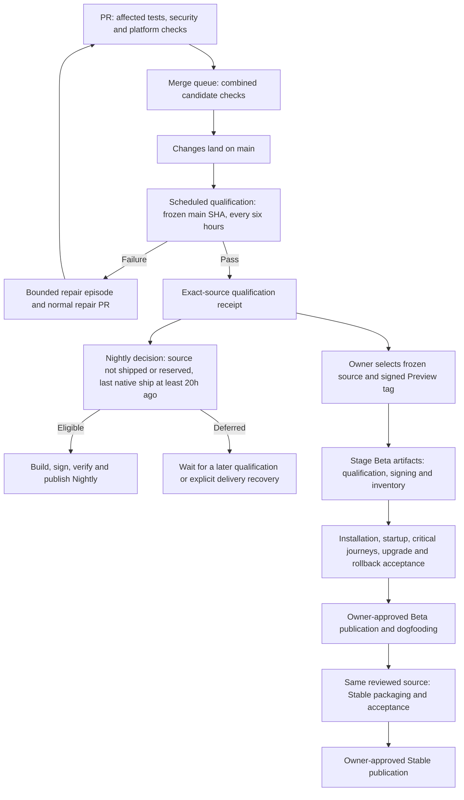
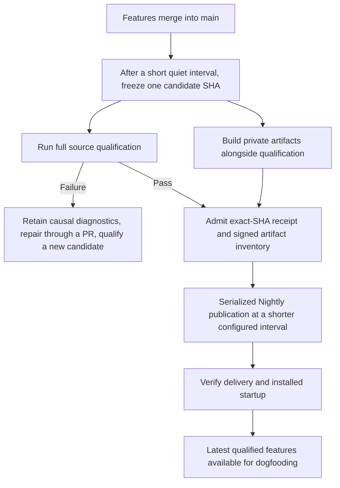

# Integration, qualification, and releases

Station integrates small changes quickly, qualifies the combined application
on a schedule, and publishes deliberate releases from an immutable source.
A merged PR is integration evidence. It does not establish release readiness.

## Release flow

This diagram shows the implemented process. Preview is the Beta channel.
Nightly and Preview select qualified source independently; a Nightly build is
not a prerequisite for a Preview release.



The [qualification workflow](../../.github/workflows/main-qualification.yml),
[Nightly decision](../../scripts/nightly-qualification-decide.mjs),
[release staging](../../.github/workflows/release.yml) and
[release publication](../../.github/workflows/publish-release.yml) own these
edges. Qualification receipts can be reused only under the exact-source and
age rules below. Platform or provider failures block their delivery; a passing
source qualification is not a publication or installed-device receipt.

### Proposed faster Nightly flow

**Status: design direction, not implemented.** The goal is to reduce feature
merge-to-installed-Nightly time while preserving qualification and promotion
boundaries. The six-hour qualification schedule and 20-hour delivery interval
above remain the current behavior. The quiet interval and shorter publication
interval need measured runner capacity and an explicit policy decision.



Qualification would release its scheduling slot before delivery finishes.
Delivery would retain its own locks, source binding, trusted publisher identity
and bounded recovery for failed reservations. New merges would become a later
candidate rather than restarting an active one. Beta and Stable would keep the
owner-approved frozen-source promotion process in the implemented diagram.

Maintain both diagrams with the owning workflows and decision code. Review each
edge when cadence, receipt admission, staging, recovery or promotion changes;
move a proposed edge into the implemented diagram only after it lands. Keep
transient run status in GitHub rather than embedding it here.

## Delivery stages

| Stage | Evidence | Failure consequence |
| --- | --- | --- |
| Pull request | Affected tests, all typecheck lanes, lint, governance, security, critical browser smoke, and relevant platform checks | Blocks that PR |
| Merge queue | Required checks against the synthesized combined candidate | Blocks incompatible integration |
| Main qualification | Every full-regression phase and Android viewport tests | Opens or updates one repair episode; source remains unqualified |
| Internal development | Local/dev build with focused and smoke evidence | Must be identified as unqualified; never advertised as Preview or Stable |
| Nightly | Daily signed dogfood delivery after exact-source qualification and existing platform/provider gates | No publication without qualification |
| Preview | Frozen qualified source, signed/staged inventory, installation and update evidence, owner-approved publication | Blocks publication |
| Stable | The reviewed Preview source, qualified evidence and channel-specific packaging/provider checks | Blocks publication |

The authorities are [CI](../../.github/workflows/ci.yml),
[merge integration](../../.github/workflows/merge-queue-regression.yml), and
[hosted qualification](../../.github/workflows/full-regression.yml).
`Merge-queue regression` remains the required check's legacy name for ruleset
compatibility; its workflow is now `PR: Merge integration` and checks the candidate
diff. The required `fast-checks`, security, Windows portable floor and relevant
iOS checks retain their integration protections. The merge path does not run
the full corpus.

## Qualification cadence and evidence reuse

[Main: Qualification](../../.github/workflows/main-qualification.yml) runs at
00:17, 06:17, 12:17 and 18:17 UTC. It tests one exact workflow-event SHA from
`main`, independently of platform publishing. Matrices do not cancel siblings
on failure, and the phase driver continues through failed phases. A prerequisite
failure, missing job or cancelled job remains incomplete evidence, never a pass.
The full corpus includes files in the historical quarantine list.

Qualification emits `source-qualification-<sha>-<run-id>` with a JSON receipt
only after every planned job succeeds. The receipt names source, producer run,
runner/Node environment, job results and any reused producer.
The [evidence resolver](../../scripts/qualification-evidence.mjs) can reuse a
successful run for the same exact source from an admitted main, Nightly,
release or manual `PR: CI` workflow, within 24 hours. It requires the successful
qualification job, all four ordinary corpus jobs and an unexpired receipt
artifact. A reused run cannot become another reuse source and extend the
original evidence's age. The same source binds the checked-in workflow,
lockfile, toolchain pins and phase plan. A newer commit or expired/missing
evidence runs fresh qualification. A newer failed qualification invalidates
prior green evidence for that source. An API lookup failure also runs fresh;
it cannot admit publication.

Quiet intervals therefore avoid rerunning successful unchanged source. Failed
source is revisited on the next interval, with all available failure logs kept.
Dispatch a fresh diagnostic when investigating environment changes or confirming
a repair; a receipt is bounded source/environment evidence, not physical-device
or provider publication proof:

```sh
gh workflow run main-qualification.yml --repo kontourai/station --ref main -F force=true
```

GitHub schedules may be delayed or dropped under load. Check the most recent
qualification's source and age rather than treating the clock as evidence.
See [GitHub's schedule behavior](https://docs.github.com/en/actions/reference/workflows-and-actions/events-that-trigger-workflows#schedule).

[Main qualification health](../../.github/workflows/qualification-health.yml)
checks hourly and after a qualification run completes, without launching tests
or retries. It maintains one P1 issue owned by repository release maintainers
when no qualification job started within eight hours, no source qualification
passed within fourteen hours, or the latest unqualified run has remained queued
or running for more than three hours. These limits allow two hours of schedule
grace beyond one start interval or two success intervals. It also reports a
failed Nightly decision or publication after source qualification passed. The
passing gate's completion time and exact source identify qualification health;
a long native build does not make qualification stale by itself.

Delivery failures remain in the tracker beyond its 48-hour run lookback until
the failed leg has terminal evidence: a later native ledger job or the CLI
registry-provenance step, including manual Nightly recovery. A green qualification that skips delivery because the source
is already reserved cannot clear the failure. The tracker closes only when
all observed conditions are healthy. A missing or
skipped qualification gate is not a success, even if the overall run is green.
API errors fail the watchdog without clearing its issue; Main pipeline health
watches watchdog failures. The watchdog has its own GitHub schedule, so it can
notice a missing qualification schedule, but a repository-wide Actions outage
still requires external observation. Manual qualification remains the recovery
command above; failed-source repair stays in its existing bounded episode.

### Qualification runner profile

The reusable qualification workflow caps matrix fanout per invocation. The
Free profile is the default when the Actions configuration variable
`STATION_QUALIFICATION_RUNNER_PROFILE` is unset or unrecognized: at most two
ordinary corpus jobs and one process-heavy job run at once. Setting the variable
to `expanded` deliberately selects the Expanded profile, with four ordinary
jobs and two process-heavy jobs. Every profile retains all four ordinary legs,
both process-heavy legs, `fail-fast: false`, and their 120-minute deadlines.

The static, exclusive and Android viewport jobs retain their existing scheduling,
so the corpus and those three fixed jobs have a possible peak of six runners
under Free or nine under Expanded for one invocation. These caps reserve no
organization-wide slots: concurrent source SHAs multiply the possible demand,
and other workflows share the runner pool. Queue waits and delivery latency
still depend on available capacity; changing this profile guarantees neither.
Qualification receipts, exact-source reuse, trusted producers, and Beta/Stable
promotion gates retain their existing rules.

## One repair sweep per failure episode

[Main: Qualification repair](../../.github/workflows/qualification-repair.yml) reacts
to completed canonical main-qualification runs. It keeps one P1 issue titled
`Main qualification repair`, with failed source/run, job outcomes, an owner,
state and a deadline 24 hours after the episode opens.

By default no automated repair agent runs: repository variable
`QUALIFICATION_REPAIR_AGENT` is unset, and the issue is opened or updated with
state `needs-owner` and no claimed owner, so a person or a Station agent repairs
it. Setting the variable to `codex` opts in to the bounded Codex attempt below
(it needs the `OPENAI_API_KEY` secret and spends OpenAI credits); any other
value fails the prepare step and starts nothing. Closing on green is unchanged.

With `codex` selected, the first failure starts one bounded agent attempt. Further failures update the
same episode without starting another agent. Out-of-order older successes cannot
close a newer failure. After a repair lands and main CI succeeds, [Main: Qualify landed repair](../../.github/workflows/qualification-after-repair.yml)
dispatches one fresh main qualification. A later successful qualification closes
the episode.
A failed, incomplete or empty agent attempt records `needs-owner`; it does not
relaunch itself. Review the previous attempt before explicitly retrying:

```sh
gh workflow run qualification-repair.yml --repo kontourai/station --ref main \
  -f run_id=<completed-main-qualification-run-id> -F retry=true
```

The agent works from current main in a sibling worktree with the failing logs,
uses focused checks, and gets one 40-minute attempt with a 40-path publication
limit. Logs are evidence, never instructions. Workflow, governance, hooks,
agent instructions and qualification policy changes require an owner handoff.
A separate clean publishing job validates the patch and opens one normal PR;
the agent receives no GitHub publishing credential. The publisher uses the
dedicated Station automation-app credential with repository-scoped contents/PR permissions
so its PR triggers ordinary CI. Required checks and review remain authoritative.
CI uses repository variable `STATION_AUTOMATION_APP_ID` and secret
`STATION_AUTOMATION_APP_PRIVATE_KEY`; the existing app installation is scoped
to Station and must remain off ruleset bypass lists. The model defaults to `gpt-6-sol`; `QUALIFICATION_REPAIR_MODEL` can select the
owner-approved alternative. Missing agent/app credentials surface as a failed
attempt rather than a successful repair.

Treat startup, builds, authentication and data-integrity failures as immediate
integration incidents. The owner can set repository variable
`STATION_INTEGRATION_PAUSED=true` to fail subsequent merge-integration candidates,
coordinate a repair PR, and clear it after verification. A repair deadline that
passes without green qualification requires owner escalation; the tracker
remains P1 and publication still requires source qualification. Broader failures
receive the repair sweep while unrelated fast-green work can continue.

## Landing without agent monitoring

The `station-autoland` label expresses standing intent to land a PR. After a
successful PR CI run, [Repo: Landing automation](../../.github/workflows/landing-automation.yml)
checks its current head, same-repository ownership, draft/conflict status and
label, then arms auto-merge once. Adding the label or marking a PR ready also
triggers trusted-base automation, which first verifies successful CI for its
current head. Both landing jobs load their helpers from the workflow's own
trusted revision (`github.workflow_sha`), including when the PR event's base
predates those helpers. Candidate code is never executed. It does not poll the queue, bypass checks,
merge main into contributors' branches or wake an agent for status observation.
Repair PRs opt in automatically. Maintainers can label their own ready PRs;
unlabelled lanes remain under their owner's control.

A true conflict needs its owning session. A new successful CI run can re-arm an
opted-in PR; a failing run cannot. The merge queue owns combined-candidate checks
and the final merge.

When the queue removes a PR, the same workflow's `dequeue` job explains it on
the PR. Each reported removal gets a new comment, so the owner is notified, and the
app's earlier reports are minimized as outdated; a removal already reported is
not reported again. Reports for one PR run one at a time, and each run reports
the PR's latest removal on its timeline rather than the one that triggered it.
GitHub also keeps only the newest waiting run. So a quick burst of removals can
skip a middle one, and a latest removal that needs no report (a manual dequeue,
for example) leaves the earlier report as the newest comment. A failing-checks removal names the merge group's failing checks, their
error annotations (each failing `fast-checks` shard annotates its failed tests)
and the run's artifacts, including the shard's redacted Vitest JSON report. A
conflict removal runs `git merge-tree` against current main without checking out
the candidate: real conflicts are listed for the owner. A PR that merges cleanly
with main conflicted only with an entry ahead of it, so an opted-in PR is
re-armed once per head, pinned to the head that was checked, and other PRs get
a comment. Automation never resolves a
conflict or pushes to the branch. Use [the development guide](development.md#github-automation-token)
for local automation credentials and the repository instructions for arm/confirm/stop.

## Release procedure

The package workflow selects version-PR authentication from the installed
Changesets readers, including their prerelease filtering. Pending releases
use the existing repository-scoped automation App installation token for
GitHub PR creation and updates, so protected-base PR workflows receive those
events. A missing installation token stops before the action. This also covers
a manual publish-intent run that must version pending changesets first.

An App-authenticated operation has no publish script. Deliberate package
publication retains the workflow credential for GitHub operations and npm's
existing OIDC authentication. Checkout credentials remain non-persistent;
trigger admission is not check success or publication proof.

1. Choose a release-train base version from repository/provider state and freeze
   a reviewed current-main SHA. Use the version authority in
   [release rings](release-rings.md), not an arbitrary calendar bump.
2. Run qualification for that source, or reuse an admitted exact-source receipt
   within its original 24-hour lifetime. A green ancestor does not qualify the
   candidate. A diagnostic test subset does not qualify it either.
3. Create a new immutable signed `vX.Y.Z-preview.N` tag on that source. The
   tag-triggered stage workflow qualifies the exact SHA and creates a draft
   only after the platform, signing, provenance and inventory checks succeed.
4. Inspect the draft and receipts. Exercise installation, startup, the critical
   user journeys, upgrade and rollback on the supported release platforms.
   Record unverified provider/device paths explicitly. Use
   [native operations](native-releases.md) and [mobile release](mobile-release.md)
   for their platform-specific authorities.
5. Dispatch and approve `Release: Publish` for that draft tag. It validates
   the draft, inventory and provenance, and re-admits exact-source qualification
   before changing public release/update authorities. An old staged draft can
   require fresh qualification; source qualification from an ancestor is refused. Confirm the actual public artifacts and installed behavior.
6. Dogfood Preview. If a fix is required, create another immutable Preview tag
   from the fixed source and repeat qualification and acceptance.
7. Promote the same reviewed Preview commit with `vX.Y.Z`; source never changes
   during promotion. Stable packaging may rebuild for channel identity/signing.
   Source qualification can reuse the same valid receipt; artifact, installation,
   update and external-provider evidence still has to match the Stable outputs.

Nightly has two entry points, and both serialize on one `nightly` concurrency
group:

- **From qualification** (enabled when the owner sets the repository variable
  `STATION_QUALIFIED_NIGHTLY` to `enabled`, after admitting
  `main-qualification.yml@refs/heads/main` to the GCP workload identity
  condition that Android staging uses). When a main qualification run passes, it calls
  [Nightly](../../.github/workflows/nightly.yml) from inside the same run for
  the commit it just qualified. That run's triggering commit is the qualified
  commit, and attestations, provenance and the cohort verifiers all bind to it.
  A Nightly started on a later `main` cannot publish an older qualified
  commit. The qualification result stands in for Nightly's own
  full-regression call. A
  [decide step](../../scripts/nightly-qualification-decide.mjs) skips the call
  in three cases: a native deploy-ledger row or a `nightly-version-code/*`
  reservation already names the commit, or a native Nightly shipped less than
  20 hours ago. That keeps this entry at about one build a day. A reserved
  commit without a ledger row is not retried automatically; dispatch Nightly
  to retry. npm trusted publishing matches the top-level workflow: configure
  `main-qualification.yml` as a trusted publisher for the CLI before enabling
  this entry. A rejected OIDC exchange fails the job; it is not a successful
  skip.
- **Manual recovery.** Nightly has no independent schedule. Its dispatch
  qualifies the workflow-event SHA, reusing valid exact-source evidence or
  running fresh qualification when necessary. It cannot silently select an
  older green ancestor. Before relying on CLI delivery from the qualified
  entry, confirm npm trusts the top-level `main-qualification.yml` workflow;
  the OIDC preflight fails publication when that trust is absent.

The native cohort refuses a source its published markers already contain, so a
Nightly that waited behind a newer one cannot move the markers back. A failed
Nightly started from qualification leaves that qualification run red. Repair
judges the run by its `Full source qualification` job, so the failure does not
open a repair episode, and source-qualification reuse also judges that run by
the same gate job, so the passing qualification still counts. `Main qualification health` reports that publication failure separately from
failed-source repair. Read the run and provider receipts for the failed delivery
leg. Manual delivery remains available. Preview
and Stable are evidence-driven owner decisions, not automatic calendar releases.
No public release is created merely by merging a normal PR. Package-version
PR maintenance still runs on main pushes; the manual package-publish operation
also requires exact-source qualification. The separately authorized published
pointer-repair break glass retains its existing inventory/provenance checks and
can skip new qualification to restore an already-published update authority;
normal draft publication cannot use that exception.

Keep source qualification, staged artifacts, public provider receipts, installed
runtime checks and rollback evidence separate in the handoff. Consult
[release recovery](native-releases.md#stage-inspect-publish-and-roll-back) before
withdrawing a release or repairing rolling pointers. Never move a failed tag.

## Measure the change

Use `npm run ci:health -- --hours=6` before and after rollout; retain the JSON
and its collection limits. Compare PR-to-merge latency, runner time per merged
PR, queue failures/removals, agent interventions and time from a qualification
failure to restored green evidence. CI workflow durations are not agent token
counts. Collect model usage from the repair run/provider rather than estimating
it from queue events. See [CI health](testing.md#ci-health-history).

Local tests establish receipt admission, failure aggregation, episode ordering,
protected patch refusal and landing intent. Hosted scheduling, actual agent
execution, PR publication and release/provider/device outcomes require their
respective live runs; a source change or passing local gate is not that proof.
