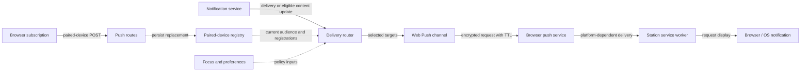

# Web Push notifications

Web Push is the browser delivery channel for a paired, subscribed device. A
supported browser can receive a notification while its Station tab is closed.
Delivery depends on the current audience, preferences, focus policy, browser,
and push service; pairing or a successful send request is not a phone receipt.

This guide covers browser Web Push, separately from the native Android FCM and
iOS APNs channels. Normal runtime
wiring disables Web Push when hosted-tenant execution is required: its routes
return 404 and the delivery wiring is inactive. Personal-host operation and
[Device pairing](connections.md) are separate prerequisites from browser support.

## Registration and delivery

Solid arrows represent requests/events; dotted arrows represent state access.
The last delivery/display steps require real browser and service evidence.
Follow [push routes](../../src-server/routes/operations/push-routes.ts), the
[router](../../src-server/services/notifications/delivery/router.ts),
[channel](../../src-server/services/notifications/web-push-channel.ts), and
[service worker](../../src-ui/public/sw.js) for the actual callers.

### Keys and stored subscriptions

[VapidKeyService](../../src-server/services/notifications/vapid-key-service.ts)
loads and caches the keypair at
`<STATION_HOME>/security/vapid-keys.json`, generating it when absent. Persistence
uses a temporary file, fsync and rename. The implementation enforces the 0600
file mode on POSIX and rejects a symlinked or hard-linked key file. Its Windows
path does not configure or verify a private ACL; that custody needs separate
platform evidence.

The [private paired-device record](../../src-server/services/ssh/device-pairing-service.ts)
holds one `pushSubscription`; it is omitted
from the public `PairedDevice` view. `POST /api/system/push-subscribe` replaces
it, and `POST /api/system/push-unsubscribe` clears it. Changes persist before
becoming live in the service's memory. Successful revocation clears the stored
subscription and removes the device from future listings. It does not delete
the browser's local PushManager object or recall a message already handed to a
push service or displayed on screen.

### Authentication and UI state

Subscribe/unsubscribe resolve the request credential to a paired device through
`identifyDevice`. An operator credential alone is insufficient; an unidentified
caller reaching the route gets `403 {error: 'device_pairing_required'}`. The
outer credential gate can reject earlier with
`401 {error: {code: 'authentication_required'}}`. Current audit reasons distinguish
`credential_invalid` and `credential_missing`; the response is not a unique
explanation of why authentication failed.

The [SDK subscription helpers](../../packages/sdk/src/query-domains/chatRuntimeDevice.ts)
map those two response combinations to the hook's **Pair this device first**
message. However, subscription first fetches the VAPID public key. Any non-OK
response from that earlier request currently becomes **Server does not support
push notifications**, so an authentication refusal can appear as unsupported
before the pairing-specific mapping runs. Other authorization/rate-limit failures
also need their own diagnosis.

[usePushNotifications](../../src-ui/src/hooks/usePushNotifications.ts), mounted
once by the app shell, registers
`/sw.js`, requests permission on subscription, creates a PushManager subscription,
and posts it to the selected Station. **Subscribed** requires that Station's
successful registration response and a browser subscription whose application
server key matches the Station's VAPID key. An existing local subscription is
checked and re-registered on mount without requesting permission. Switching to
a Station with a different key leaves the previous subscription intact; the
explicit **Enable push notifications** action can replace it for the new Station.

The Settings → Notifications & voice **Push notifications** switch removes the
browser's existing subscription when turned off, then attempts server cleanup.
Importing an Off preference or restoring device defaults performs the same
cleanup without opening Notifications. Mounting the app does not request
notification permission. Settings reads the shell's subscription state, so
changing routes cannot abandon a pending disable operation. A disable
invalidates an older subscription attempt even if the preference is enabled
again before that attempt finishes.
Turning it back on shows the subscription controls; subscribing still requires
the **Enable push notifications** action. The separate **Unsubscribe** action
also removes the local subscription and attempts server cleanup as best effort.
Repeated Enable calls share one pending attempt. Unsubscribe invalidates pending
attempts and cleans up any registration response that arrives afterward.
If server cleanup fails, a stored registration can remain
until later cleanup. Browser state, server registration and actual delivery are
three different observations; the label alone does not establish all three.

## Who receives a push

`WebPushChannel.accepts` uses
[the category classifier](../../packages/shared/src/notification-priority.ts).
Current categories include approval requests, job failures/misses, unhealthy
scheduler notices, turn completion/stop/failure, pairing requests, and the Agent
attention/failed/done/info categories. Lifecycle `needs_input` and
`review_pending` projections are not themselves notification delivery events;
a separate approval notification can represent related work.

The [audience resolver](../../src-server/services/notifications/delivery/audience-resolver.ts)
selects active personal-family devices with the required read eligibility. It
excludes delegated Stations, pending enrollment and account-bound devices from
this current family. Every named Session also requires the recipient's own
principal to be able to read it, including legacy notifications. A reserved
`principal` audience has no delivery implementation yet. Pairing alone is not
sufficient audience membership.

The router consumes `NOTIFICATION_DELIVERED`. It also handles content changes to
previously seen, delivered, unread enveloped records on `NOTIFICATION_UPDATED`;
legacy records keep delivery-event behavior. Read/dismiss/settled changes cancel
pending escalation. Channel exceptions are caught so a push failure does not
throw through the synchronous in-app notification path. This is an error-isolation
property, not a guarantee of every browser's SSE/toast experience.

### Focus, preferences, and escalation

Focus applies within the same principal; unbound owner-device identities are
grouped, while tailnet-bound people remain distinct. A focused document must
also have its own live event stream. Another tab's stream cannot vouch for it.
Stream leases expire after 90 seconds without successful keepalive writes; focus
reports have a 120-second lease. There are caps of 32 documents per device,
32 operator tabs, and 256 device streams overall. A document beyond a cap does
not qualify as live.

A live focused document suppresses `info`/`done` on the person's other surfaces
and can defer `attention`/`failed`. Default escalation is three minutes. It is
one in-memory recheck of the current record, audience, registrations, focus and
preferences—not a delivery guarantee or general retry queue. Quiet hours, mute,
minimum urgency, silent interrupt, current focus, read/dismiss state or expiry
can still suppress it. Restart loses timers, and eviction beyond the router's
500 tracked records cancels the oldest pending escalation. Channel `retry`
outcomes currently have no general retry scheduler consuming them.

The focus check also has a transport limit: successful writes do not prove a
half-open socket is being read. A closed tab stops reporting focus, bounding its
lease; an open tab that keeps reporting focus with a half-open `/events` stream
can suppress longer. The current `/events` client supplies no stream-stall timeout.
These are source-level limits, not measured phone-delivery timings.

## Payload, expiry, and removal

The [composer](../../src-server/services/notifications/push-payload-composer.ts)
can rank several candidates by outcome and recency, but the live channel passes
only the notification that just triggered delivery. It does not replace that
fresh event with an older, higher-ranked unresolved notification. Multi-item
ranking is tested helper behavior, not a deployed digest surface.

| Outcome | Push-service retention TTL |
| --- | --- |
| Needs input or failed | 24 hours |
| Done | 15 minutes |
| Info | 4 hours |
| Running | 2 hours; currently reserved with no category mapping |

These are category defaults converted to seconds for the Web Push request.
They limit how long the push service may hold an offline delivery, not how long
a displayed OS notification remains. Stored `Notification.ttl` has its own
caller-overridable value and expiration measured from delivery. The composer
uses its category default, not that override or the stored record's remaining
lifetime.

A device's hide-content preference substitutes generic title/body text. The
browser still receives category, notification ID and destination URL. For
routing, Session metadata is tried first (`sessionId` or `conversationId`), then
a validated relative `metadata.link`, then `/notifications`. Managed Sessions
legitimately use `/?chat=...&dock=open`; the root route with these parameters is
not an error. The current composed payload does not carry the legacy service
worker's approval-action fields, so those old action branches are not this
channel's live payload path.

On a tap, the worker closes that notification and attempts to focus/navigate a
window or open one. Navigation can fail; there is no replacement-window fallback
after a rejected existing-window navigation. Verify the actual destination on
the target platform rather than claiming the URL alone proves successful display.

Web Push has `retract: false`. Read, dismissal or expiry on the host does not
proactively remove an already displayed browser notification. The worker closes
clicked notifications and reuses tags on later pushes; it does not reconcile
host read/expiry state. A 404/410 response from a push service triggers stored
subscription cleanup, but an old in-flight send can currently clear a newer
replacement. [#2753](https://github.com/kontourai/station/issues/2753) tracks that
identity race and its required regression cases.

## Manual phone checklist

The following checks are **NOT_VERIFIED** by this audit's fixtures. Use a supported
browser in a secure context with Service Worker/Push API support and permission.
Tailnet reachability alone does not establish those prerequisites. Native FCM/APNs
need their separate platform journeys.

1. Pair the browser with the intended personal-mode Station. Use its device
   credential, not only an operator credential.
2. In Settings → Notifications, expose the push controls, choose **Enable push
   notifications**, and grant browser permission. Check successful server
   registration as well as the local **Subscribed** label.
3. Close the tab. Make other surfaces' focus, quiet hours, mutes, urgency policy
   and Session read eligibility explicit; otherwise a missing push is ambiguous.
4. Trigger a uniquely identifiable approval/notification and observe actual
   arrival. Account for the configured escalation delay without treating it as
   a promise that delivery must occur.
5. Tap it and verify the emitted Session/work destination or `/notifications`
   fallback. Record navigation failure rather than treating it as impossible.
6. Open the connection manager's **Paired devices** panel and revoke that device.
   Trigger a new identifiable event afterward; distinguish it from older queued
   or in-flight pushes. Confirm the host no longer lists a subscription for the
   revoked device.
7. Exercise **Unsubscribe** separately from the Settings feature switch. Check
   both local and host state, including remount after a rejected registration.
8. Check denied permission and unsupported-browser states. The subscribe button
   can read **Notifications blocked by browser**; unsupported capability hides
   that control rather than proving the whole feature works elsewhere.

Record the exact build, Station/device identities, browser/platform, prerequisites,
and each observed result. Route/router/hook fixtures passed in this audit, but no
real push service, OS display, Windows ACL or physical phone journey was run.
The declared send metric records the request result, not a phone receipt, and
[OTel collection has its own limits](monitoring.md).
