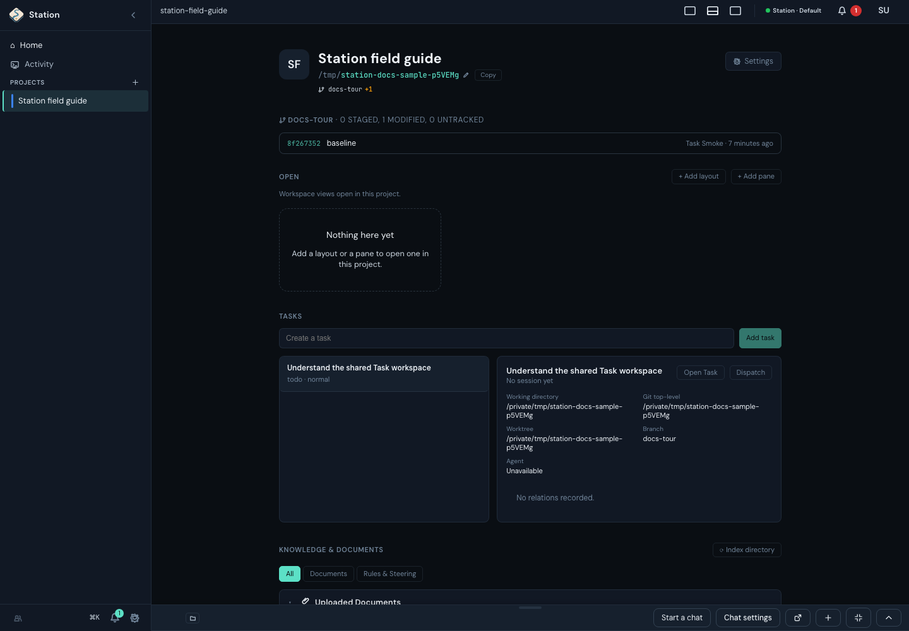
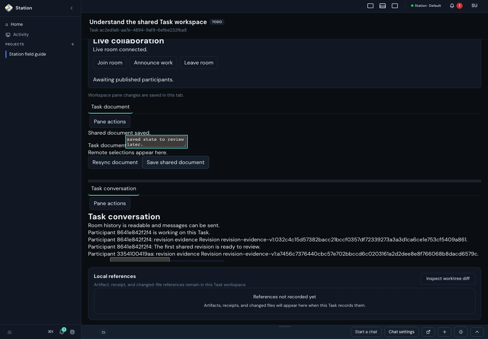
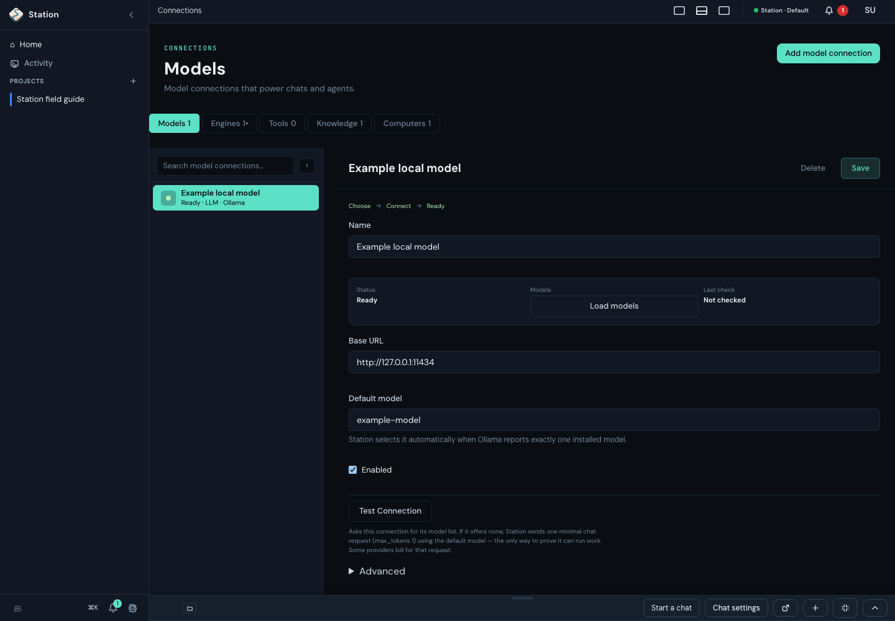
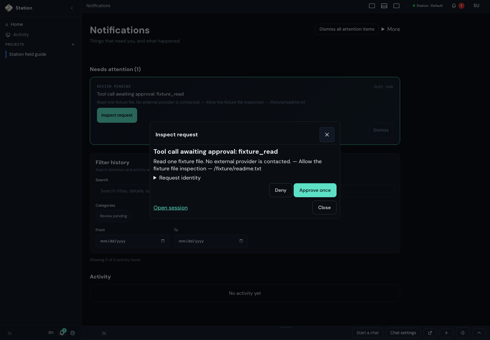
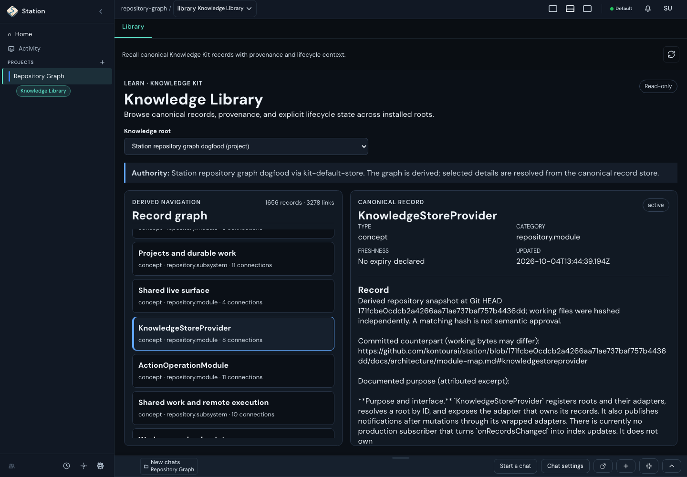
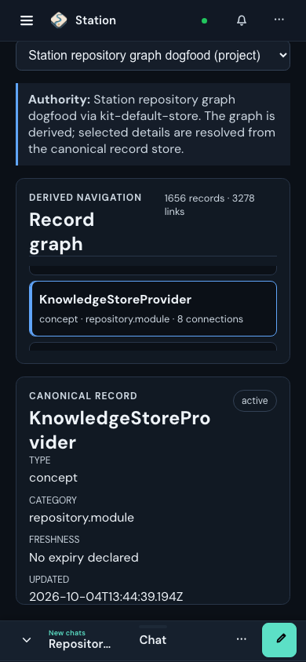

# See Station in use

These captures put the architecture next to the application. They use isolated
Station instances and sample data. Each caption distinguishes persisted behavior
from a controlled response or provider fixture. The capture revisions are
recorded in [the media manifest](media.json), and each capture's reviewed source
files in the [review ledger](review-ledger/captures/docs/learn/media/).

## Projects and Tasks

A Project gives work a workspace and a durable identity. Here, the Project
contains a saved Task even though no Agent Session has started. That distinction
matters: work can exist before an engine is ready to execute it.

The Task's shared document and conversation keep revisions and discussion with
that work. In this example a person saved a document; the room history records
revision evidence. This does not demonstrate an external Agent editing alongside
them. The current editor uses the available width and gives a multi-paragraph
brief room to breathe. [#2844](https://github.com/kontourai/station/issues/2844)
also tracks heading/focus and revision-label usability; this capture does not
establish that every part of that issue is resolved.

The Project capture retains its original revision and appearance. The Task
document capture was replaced after actual single-user save/send/reopen checks.
The current Task
workspace leads with the objective and shared room, keeps technical identity
behind **Task and workspace details**, and gives the editor and message field
responsive width. The captures above do not verify agent participation,
two-human collaboration, or every issue in #2844. The [shared-work delivery ledger](../plans/shared-work-delivery.md)
records the broader channel, board, agent and preview work still to deliver.

Continue with [Starter Work](../guides/starter-work.md),
[shared working state](../design/shared-working-state.md), and the
[Task room acceptance boundaries](../reference/project-task-room-collaboration-acceptance.md).
The [Task room runtime](../../src-server/services/orchestration/project-task-room-runtime.ts)
owns the server composition.

## Connections

Model connections let Station's engine use a model service. Engine connections
reach an agent app that owns its own loop. The tabs separate those responsibilities.

This screenshot uses **sample API responses**. Its Ready label shows how that
state is presented; it is not a successful test against a live model service.
The detail pane exposes the endpoint, chosen model, last check and test action.
The replacement screenshot shows the resting selection. Earlier captures
recorded reduced selected-row hover contrast; [#2843](https://github.com/kontourai/station/issues/2843)
tracks that usability work. The shared SplitPane stylesheet now preserves normal
text colors over a selected-row tint and retains that treatment on hover. This
capture alone does not measure hover contrast across every consuming view.
Its connection headings and test explanation predate the newer intent-first
wording and the disclosure before Create. The current form explains credential
prerequisites and its immediate, potentially billable check before creating a
connection; this older capture does not show that guidance. The recorded
capture revision and sample-data limits remain explicit.

This short, silent walkthrough opens the model's settings, switches to Engines,
and expands an engine's details. The sample engine still needs setup. It does
not run a connection test or log in to an account.

Read [Connections](../guides/connections.md) for the readiness states and
[smoke confidence](../reference/agent-smoke-confidence.md) for what an explicitly
requested test establishes. The [connection form](../../src-ui/src/views/provider-settings/ProviderConnectionForm.tsx)
is the UI owner; the [connection service](../../src-server/services/connections/connection-service.ts)
owns runtime observations.

## Inspect an approval

An attention item can point to an exact pending request. **Inspect request**
opens its scope and available responses. **Request identity** exposes the
underlying identifiers; opening this panel does not approve the action.

This example uses a controlled provider behind real request routes and an event
store. It inspects a synthetic file-read request without deciding it or contacting
an external provider. In ordinary work, read the request before choosing a response;
a changed or unavailable request needs a fresh inspection.

Continue with [approval and receipt inspection](../guides/starter-work.md#inspect-approval-and-review-evidence)
and the [Session API](../reference/session-api.md). A request decision authorizes
an action; it is not a review of the resulting work or a passed gate.

The silent clip follows those steps: open **Inspect request**, expand
**Request identity**, then close the inspector. Neither decision button is used.

## Explore repository knowledge

The Knowledge Library example can display the repository graph through Station's
public Knowledge API. Select a record on the left to read its canonical content
on the right. The list and detail panes scroll independently, so a deep selection
does not move the detail out of reach. At narrow widths they stack vertically.

These captures use an actual imported snapshot: 1,656 records and 3,278 links.
Those counts describe this capture, not a fixed application limit or the latest
repository. The record identifies the snapshot and attributes its purpose text
to the module map. No model, embedding service or vector index was used.

Follow the [repository graph guide](../guides/repository-knowledge-graph.md) to
create a fresh snapshot, or the [Knowledge Library example](../../examples/knowledge-library/README.md)
to understand the UI and its read-only permissions.

## Follow the implementation

Use the [learning branches](README.md#reading-branches) to move from a scenario to
its modules and source. The [repository knowledge graph](../guides/repository-knowledge-graph.md)
connects those explanations to referenced code, tests and decisions. A screenshot
or graph link is evidence to inspect, not proof of every platform or failure path.
